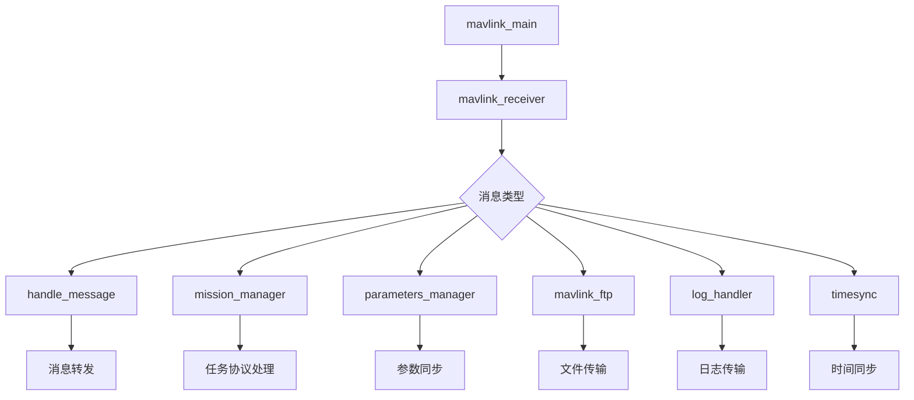

# PX4 MAVLink 模块文件结构详解

## 概述

本文档详细说明PX4中MAVLink模块目录下各个文件的作用和功能，帮助开发者理解MAVLink模块的架构和组织结构。

## 1. 核心主文件

### 1.1 mavlink_main.cpp / mavlink_main.h
**作用：** MAVLink模块的主入口和核心控制器
- **主要功能：**
  - 模块启动和初始化
  - 任务管理和实例控制
  - 通信协议配置（串口/UDP）
  - 数据流管理和配置
  - 主循环控制和调度

<augment_code_snippet path="src/modules/mavlink/mavlink_main.cpp" mode="EXCERPT">
````cpp
extern "C" __EXPORT int mavlink_main(int argc, char *argv[])
{
    if (!strcmp(argv[1], "start")) {
        return Mavlink::start(argc, argv);
    } else if (!strcmp(argv[1], "stop-all")) {
        return Mavlink::destroy_all_instances();
    }
    // ... 其他命令处理
}
````
</augment_code_snippet>

### 1.2 mavlink_receiver.cpp / mavlink_receiver.h
**作用：** MAVLink消息接收和解析处理器
- **主要功能：**
  - 独立接收线程管理
  - MAVLink消息解析和验证
  - 消息分发到各个处理模块
  - 协议版本检测和切换
  - 接收统计和错误处理

<augment_code_snippet path="src/modules/mavlink/mavlink_receiver.cpp" mode="EXCERPT">
````cpp
void MavlinkReceiver::run()
{
    while (!_mavlink->should_exit()) {
        // 消息接收和解析
        if (mavlink_parse_char(_mavlink->get_channel(), buf[i], &msg, &_status)) {
            handle_message(&msg);                    // 通用消息处理
            _mission_manager.handle_message(&msg);   // 任务管理
            _parameters_manager.handle_message(&msg); // 参数管理
        }
    }
}
````
</augment_code_snippet>

## 2. 消息处理模块

### 2.1 mavlink_messages.cpp / mavlink_messages.h
**作用：** MAVLink消息格式化和流管理
- **主要功能：**
  - 定义所有支持的MAVLink消息流
  - 消息格式化和序列化
  - 流创建和管理工厂函数
  - 消息发送调度

### 2.2 mavlink_stream.cpp / mavlink_stream.h
**作用：** 数据流基类和调度机制
- **主要功能：**
  - 数据流基类定义
  - 发送频率控制和调度
  - 流状态管理
  - 带宽自适应控制

<augment_code_snippet path="src/modules/mavlink/mavlink_stream.cpp" mode="EXCERPT">
````cpp
int MavlinkStream::update(const hrt_abstime &t)
{
    update_data();

    if (dt > (interval - (_mavlink->get_main_loop_delay() / 10) * 3)) {
        // 间隔到期，发送消息
        if (send()) {
            _last_sent = t;
            return 0;
        }
    }
    return -1;
}
````
</augment_code_snippet>

## 3. 功能模块

### 3.1 mavlink_mission.cpp / mavlink_mission.h
**作用：** 任务管理协议实现
- **主要功能：**
  - 任务上传/下载协议
  - 航点管理和验证
  - 任务状态同步
  - 任务执行监控

### 3.2 mavlink_parameters.cpp / mavlink_parameters.h
**作用：** 参数同步协议实现
- **主要功能：**
  - 参数读取/写入协议
  - 参数列表管理
  - 参数值同步
  - 参数变更通知

### 3.3 mavlink_ftp.cpp / mavlink_ftp.h
**作用：** 文件传输协议实现
- **主要功能：**
  - 文件上传/下载
  - 目录浏览
  - 文件操作（创建、删除、重命名）
  - 传输状态管理

### 3.4 mavlink_log_handler.cpp / mavlink_log_handler.h
**作用：** 日志传输处理
- **主要功能：**
  - 日志文件管理
  - 日志数据传输
  - 日志请求处理
  - 传输进度控制

### 3.5 mavlink_timesync.cpp / mavlink_timesync.h
**作用：** 时间同步协议实现
- **主要功能：**
  - 系统时间同步
  - 时间偏移计算
  - 时钟漂移补偿
  - 同步状态监控

## 4. 辅助功能模块

### 4.1 mavlink_command_sender.cpp / mavlink_command_sender.h
**作用：** 命令发送管理器
- **主要功能：**
  - 命令队列管理
  - 命令重发机制
  - 应答超时处理
  - 命令优先级管理

### 4.2 mavlink_events.cpp / mavlink_events.h
**作用：** 事件系统集成
- **主要功能：**
  - 系统事件转换为MAVLink消息
  - 事件缓冲和管理
  - 事件优先级处理
  - 事件过滤和格式化

### 4.3 mavlink_shell.cpp / mavlink_shell.h
**作用：** 远程Shell访问
- **主要功能：**
  - 远程命令执行
  - Shell会话管理
  - 输入/输出重定向
  - 安全访问控制

### 4.4 mavlink_ulog.cpp / mavlink_ulog.h
**作用：** ULog数据流传输
- **主要功能：**
  - 实时日志数据流
  - ULog格式转换
  - 流控制和缓冲
  - 数据压缩和传输

## 5. 工具和辅助类

### 5.1 mavlink_rate_limiter.cpp / mavlink_rate_limiter.h
**作用：** 速率限制器
- **主要功能：**
  - 消息发送速率控制
  - 带宽管理
  - 优先级调度
  - 流量整形

### 5.2 mavlink_simple_analyzer.cpp / mavlink_simple_analyzer.h
**作用：** 简单的MAVLink分析器
- **主要功能：**
  - 消息统计分析
  - 通信质量监控
  - 错误检测和报告
  - 性能指标收集

### 5.3 MavlinkStatustextHandler.cpp / MavlinkStatustextHandler.hpp
**作用：** 状态文本消息处理
- **主要功能：**
  - 状态消息格式化
  - 消息优先级管理
  - 重复消息过滤
  - 消息缓冲和发送

### 5.4 tune_publisher.cpp / tune_publisher.h
**作用：** 音调发布器
- **主要功能：**
  - 音调序列管理
  - 音调播放控制
  - RTTTL格式支持
  - 音调状态同步

## 6. 配置和构建文件

### 6.1 CMakeLists.txt
**作用：** 构建配置文件
- **主要内容：**
  - 源文件列表
  - 编译选项配置
  - 依赖库管理
  - 模块配置

### 6.2 Kconfig
**作用：** 内核配置选项
- **主要内容：**
  - 功能开关配置
  - 编译时选项
  - 平台相关配置
  - 资源限制设置

### 6.3 module.yaml
**作用：** 模块元数据配置
- **主要内容：**
  - 模块描述信息
  - 参数定义
  - 命令行接口
  - 依赖关系

## 7. 数据流定义目录 (streams/)

### 7.1 目录结构
streams/ 目录包含所有MAVLink消息流的具体实现，每个.hpp文件对应一个MAVLink消息类型：

**核心状态流：**
- `HEARTBEAT.hpp` - 心跳消息
- `SYS_STATUS.hpp` - 系统状态
- `ATTITUDE.hpp` - 姿态信息
- `GLOBAL_POSITION_INT.hpp` - 全球位置
- `LOCAL_POSITION_NED.hpp` - 本地位置

**传感器数据流：**
- `HIGHRES_IMU.hpp` - 高精度IMU数据
- `SCALED_IMU.hpp` - 缩放IMU数据
- `GPS_RAW_INT.hpp` - GPS原始数据
- `SCALED_PRESSURE.hpp` - 气压数据

**控制和执行器流：**
- `SERVO_OUTPUT_RAW.hpp` - 舵机输出
- `ACTUATOR_OUTPUT_STATUS.hpp` - 执行器状态
- `RC_CHANNELS.hpp` - 遥控通道

**任务和导航流：**
- `NAV_CONTROLLER_OUTPUT.hpp` - 导航控制器输出
- `MISSION_CURRENT.hpp` - 当前任务
- `POSITION_TARGET_*.hpp` - 位置目标

### 7.2 流实现模式
每个流文件都遵循相同的模式：

<augment_code_snippet path="src/modules/mavlink/streams/HEARTBEAT.hpp" mode="EXCERPT">
````cpp
class MavlinkStreamHeartbeat : public MavlinkStream
{
public:
    static MavlinkStream *new_instance(Mavlink *mavlink) {
        return new MavlinkStreamHeartbeat(mavlink);
    }

    const char *get_name() const override { return "HEARTBEAT"; }
    static uint16_t get_id_static() { return MAVLINK_MSG_ID_HEARTBEAT; }
    uint16_t get_id() override { return get_id_static(); }

    bool send() override {
        // 消息发送实现
    }
};
````
</augment_code_snippet>

## 8. MAVLink协议库 (mavlink/)

### 8.1 mavlink/ 子目录
这是MAVLink协议的官方实现，包含：
- **message_definitions/** - XML消息定义文件
- **pymavlink/** - Python工具和库
- **examples/** - 使用示例
- **doc/** - 协议文档

### 8.2 关键文件
- `mavgenerate.py` - 消息代码生成工具
- `MAVLinkConfig.cmake.in` - CMake配置模板
- `CONTRIBUTING.md` - 贡献指南
- `README.md` - 协议说明

## 9. 测试文件

### 9.1 mavlink_tests/ 目录
包含MAVLink模块的单元测试：
- `mavlink_ftp_test.cpp` - FTP功能测试
- `mavlink_tests.cpp` - 综合测试套件

## 10. 其他重要文件

### 10.1 mavlink.c
**作用：** C语言兼容性包装
- 提供C语言接口
- 兼容性函数实现

### 10.2 mavlink_bridge_header.h
**作用：** 桥接头文件
- MAVLink库配置
- 平台相关定义
- 编译选项设置

### 10.3 mavlink_params.c
**作用：** 参数系统集成
- 参数访问接口
- 类型转换函数
- 兼容性支持

### 10.4 timestamped_list.h
**作用：** 时间戳列表工具
- 时间戳管理
- 列表操作工具
- 数据结构定义

## 总结

MAVLink模块采用模块化设计，各文件职责明确：

1. **核心控制** - mavlink_main.* 负责整体控制和管理
2. **消息处理** - mavlink_receiver.* 负责消息接收和分发
3. **协议实现** - 各功能模块实现具体的MAVLink协议
4. **数据流** - streams/ 目录定义所有消息流的具体实现
5. **工具支持** - 提供各种辅助工具和分析功能

这种架构设计使得MAVLink模块具有良好的可扩展性和维护性，便于添加新的消息类型和功能模块。

## 11. 详细功能模块分析

### 11.1 消息处理流程图



### 11.2 数据流分类详解

#### 11.2.1 系统状态流
- **HEARTBEAT.hpp** - 系统心跳，1Hz固定频率
- **SYS_STATUS.hpp** - 系统状态（电池、传感器健康状态）
- **EXTENDED_SYS_STATE.hpp** - 扩展系统状态
- **AUTOPILOT_VERSION.hpp** - 自驾仪版本信息
- **PROTOCOL_VERSION.hpp** - 协议版本信息

#### 11.2.2 导航和位置流
- **ATTITUDE.hpp** - 姿态信息（欧拉角）
- **ATTITUDE_QUATERNION.hpp** - 姿态四元数
- **GLOBAL_POSITION_INT.hpp** - 全球坐标位置
- **LOCAL_POSITION_NED.hpp** - 本地NED坐标位置
- **HOME_POSITION.hpp** - 起飞点位置
- **GPS_RAW_INT.hpp** - GPS原始数据
- **GPS2_RAW.hpp** - 第二个GPS数据
- **GPS_STATUS.hpp** - GPS状态信息

#### 11.2.3 传感器数据流
- **HIGHRES_IMU.hpp** - 高分辨率IMU数据
- **SCALED_IMU.hpp** - 缩放IMU数据（IMU1）
- **SCALED_IMU2.hpp** - 第二个IMU数据
- **SCALED_IMU3.hpp** - 第三个IMU数据
- **SCALED_PRESSURE.hpp** - 气压传感器数据
- **DISTANCE_SENSOR.hpp** - 距离传感器数据
- **OPTICAL_FLOW_RAD.hpp** - 光流传感器数据

#### 11.2.4 控制和执行器流
- **SERVO_OUTPUT_RAW.hpp** - 舵机原始输出
- **ACTUATOR_OUTPUT_STATUS.hpp** - 执行器输出状态
- **RC_CHANNELS.hpp** - 遥控器通道数据
- **MANUAL_CONTROL.hpp** - 手动控制输入
- **ATTITUDE_TARGET.hpp** - 姿态目标设定值
- **POSITION_TARGET_LOCAL_NED.hpp** - 本地位置目标
- **POSITION_TARGET_GLOBAL_INT.hpp** - 全球位置目标

#### 11.2.5 任务和导航流
- **NAV_CONTROLLER_OUTPUT.hpp** - 导航控制器输出
- **MISSION_CURRENT.hpp** - 当前任务项
- **MISSION_ITEM_REACHED.hpp** - 任务项到达通知
- **ORBIT_EXECUTION_STATUS.hpp** - 轨道执行状态
- **FIGURE_EIGHT_EXECUTION_STATUS.hpp** - 8字飞行状态

### 11.3 协议处理模块详解

#### 11.3.1 任务管理协议 (mavlink_mission.*)
```cpp
// 主要消息类型处理
- MISSION_REQUEST_LIST     // 请求任务列表
- MISSION_COUNT           // 任务数量
- MISSION_REQUEST         // 请求特定任务项
- MISSION_ITEM            // 任务项数据
- MISSION_ACK             // 任务确认
- MISSION_SET_CURRENT     // 设置当前任务
- MISSION_CLEAR_ALL       // 清除所有任务
```

**状态机管理：**
- IDLE - 空闲状态
- RECEIVING - 接收任务中
- SENDING - 发送任务中
- PARTIAL_RECEIVING - 部分接收中

#### 11.3.2 参数管理协议 (mavlink_parameters.*)
```cpp
// 主要消息类型处理
- PARAM_REQUEST_LIST      // 请求参数列表
- PARAM_REQUEST_READ      // 读取特定参数
- PARAM_SET               // 设置参数值
- PARAM_VALUE             // 参数值响应
```

**参数同步机制：**
- 支持按索引和按名称访问
- 参数类型自动检测和转换
- 参数变更通知和确认
- 批量参数传输优化

#### 11.3.3 文件传输协议 (mavlink_ftp.*)
```cpp
// FTP操作类型
- kCmdNone                // 无操作
- kCmdTerminateSession    // 终止会话
- kCmdResetSessions       // 重置会话
- kCmdListDirectory       // 列出目录
- kCmdOpenFileRO          // 只读打开文件
- kCmdReadFile            // 读取文件
- kCmdCreateFile          // 创建文件
- kCmdWriteFile           // 写入文件
- kCmdRemoveFile          // 删除文件
- kCmdCreateDirectory     // 创建目录
- kCmdRemoveDirectory     // 删除目录
- kCmdOpenFileWO          // 只写打开文件
```

**传输特性：**
- 支持断点续传
- 文件完整性校验
- 并发会话管理
- 错误恢复机制

### 11.4 工具类详细功能

#### 11.4.1 速率限制器 (mavlink_rate_limiter.*)
**功能特性：**
- 令牌桶算法实现
- 多级优先级支持
- 动态速率调整
- 突发流量控制

#### 11.4.2 简单分析器 (mavlink_simple_analyzer.*)
**分析指标：**
- 消息接收统计
- 错误率计算
- 延迟测量
- 带宽利用率
- 丢包率统计

#### 11.4.3 状态文本处理器 (MavlinkStatustextHandler.*)
**处理功能：**
- 消息优先级分类（INFO, WARNING, ERROR, CRITICAL）
- 重复消息抑制
- 消息缓冲和批处理
- 格式化和编码转换

### 11.5 通信模式配置

#### 11.5.1 预定义模式
```cpp
enum MAVLINK_MODE {
    MAVLINK_MODE_NORMAL = 0,        // 标准模式
    MAVLINK_MODE_CUSTOM,            // 自定义模式
    MAVLINK_MODE_ONBOARD,           // 机载计算机模式
    MAVLINK_MODE_OSD,               // OSD模式
    MAVLINK_MODE_MAGIC,             // 魔术模式
    MAVLINK_MODE_CONFIG,            // 配置模式
    MAVLINK_MODE_MINIMAL,           // 最小模式
    MAVLINK_MODE_EXTVISION,         // 外部视觉模式
    MAVLINK_MODE_EXTVISIONMIN,      // 最小外部视觉模式
    MAVLINK_MODE_GIMBAL,            // 云台模式
    MAVLINK_MODE_ONBOARD_LOW_BANDWIDTH, // 低带宽机载模式
    MAVLINK_MODE_UAVIONIX,          // uAvionix模式
    MAVLINK_MODE_IRIDIUM,           // 铱星模式
};
```

#### 11.5.2 模式特定流配置
每种模式都有预定义的数据流配置，例如：

**NORMAL模式：**
- SYS_STATUS: 1Hz
- ATTITUDE: 10Hz
- GLOBAL_POSITION_INT: 5Hz
- GPS_RAW_INT: 1Hz

**ONBOARD模式：**
- HIGHRES_IMU: 50Hz
- ATTITUDE: 100Hz
- LOCAL_POSITION_NED: 30Hz
- TIMESYNC: 10Hz

### 11.6 错误处理和诊断

#### 11.6.1 错误类型
- 解析错误 - 消息格式错误
- CRC错误 - 数据完整性错误
- 序列号错误 - 消息丢失
- 超时错误 - 通信超时
- 缓冲区溢出 - 数据处理不及时

#### 11.6.2 诊断工具
- 消息统计计数器
- 错误率监控
- 性能计数器
- 调试日志输出
- 状态报告生成

### 11.7 扩展和定制

#### 11.7.1 添加新消息流
1. 在streams/目录创建新的.hpp文件
2. 继承MavlinkStream基类
3. 实现必要的虚函数
4. 在mavlink_messages.cpp中注册

#### 11.7.2 添加新协议处理
1. 创建新的处理器类
2. 在mavlink_receiver中添加消息分发
3. 实现协议状态机
4. 添加相应的配置参数

这种模块化和可扩展的设计使得PX4的MAVLink实现能够支持各种应用场景和自定义需求。
