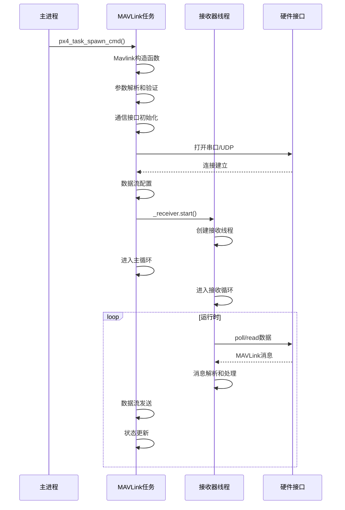

# PX4 MAVLink 启动流程详解

## 概述

本文档详细描述了PX4中MAVLink模块的完整启动流程，包括初始化、配置、通信建立和消息处理等各个阶段。

## 1. 启动入口点

### 1.1 主入口函数
```cpp
// src/modules/mavlink/mavlink_main.cpp:3307
extern "C" __EXPORT int mavlink_main(int argc, char *argv[])
```

**启动命令解析：**
- `mavlink start` - 启动MAVLink实例
- `mavlink stop` - 停止指定实例
- `mavlink stop-all` - 停止所有实例
- `mavlink status` - 显示状态信息
- `mavlink stream` - 配置数据流
- `mavlink boot_complete` - 标记启动完成

### 1.2 启动流程调用链
```
mavlink_main()
  └── Mavlink::start()
      └── px4_task_spawn_cmd("mavlink_main")
          └── Mavlink::start_helper()
              └── new Mavlink()
              └── instance->task_main()
```

## 2. 静态初始化阶段

### 2.1 全局初始化
```cpp
// src/modules/mavlink/mavlink_main.cpp:2767
int Mavlink::start(int argc, char *argv[])
{
    MavlinkULog::initialize();           // ULog系统初始化
    MavlinkCommandSender::initialize();  // 命令发送器初始化

    // 事件缓冲区初始化
    if (!_event_buffer) {
        _event_buffer = new events::EventBuffer();
        _event_buffer->init();
    }
}
```

### 2.2 实例计数检查
- 检查当前实例数量是否超过 `MAVLINK_COMM_NUM_BUFFERS`
- 防止创建过多MAVLink实例

## 3. 任务创建阶段

### 3.1 任务生成
```cpp
px4_task_spawn_cmd("mavlink_main",
                   SCHED_DEFAULT,
                   SCHED_PRIORITY_DEFAULT,
                   PX4_STACK_ADJUSTED(2896) + MAVLINK_NET_ADDED_STACK,
                   (px4_main_t)&Mavlink::start_helper,
                   (char *const *)argv);
```

**任务参数：**
- 任务名称：`mavlink_main`
- 调度策略：`SCHED_DEFAULT`
- 优先级：`SCHED_PRIORITY_DEFAULT`
- 栈大小：2896字节 + 网络栈空间

### 3.2 实例等待机制
- 等待实例计数增加，确保任务成功创建
- 超时时间：100ms
- 检查间隔：500μs

## 4. MAVLink对象构造

### 4.1 构造函数初始化
```cpp
// src/modules/mavlink/mavlink_main.cpp:101
Mavlink::Mavlink() :
    ModuleParams(nullptr),
    _receiver(this)
{
    mavlink_update_parameters();  // 参数更新

    // 系统ID和组件ID设置
    int sys_id = _param_mav_sys_id.get();
    if (sys_id > 0 && sys_id < 255) {
        mavlink_system.sysid = sys_id;
    }

    int comp_id = _param_mav_comp_id.get();
    if (comp_id > 0 && comp_id < 255) {
        mavlink_system.compid = comp_id;
    }

    // 记录首次启动时间
    if (_first_start_time == 0) {
        _first_start_time = hrt_absolute_time();
    }

    // 确保vehicle_command主题存在
    if (orb_exists(ORB_ID(vehicle_command), 0) == PX4_ERROR) {
        orb_advertise(ORB_ID(vehicle_command), nullptr);
    }
}
```

### 4.2 参数初始化
- 协议版本设置
- MAV_TYPE参数验证
- 系统和组件ID配置

## 5. 任务主循环初始化

### 5.1 命令行参数解析
```cpp
// src/modules/mavlink/mavlink_main.cpp:1795
int Mavlink::task_main(int argc, char *argv[])
```

**主要参数：**
- `-d` : 设备名称（串口）
- `-b` : 波特率
- `-r` : 数据速率
- `-m` : 模式（normal, custom, onboard等）
- `-u` : UDP端口
- `-o` : UDP远程端口
- `-t` : 数据流配置

### 5.2 文件描述符处理
- 检查stdin(0), stdout(1), stderr(2)
- 如果未打开，重定向到/dev/null
- 防止USB自启动时的文件描述符问题

### 5.3 默认参数设置
```cpp
_baudrate = 57600;           // 默认波特率
_datarate = 0;               // 数据速率（自动计算）
_mode = MAVLINK_MODE_COUNT;  // 模式（后续设置为NORMAL）
```

## 6. 通信协议配置

### 6.1 协议类型判断
- **串口协议**：检查设备名称格式
- **UDP协议**：检查网络端口配置

### 6.2 USB串口特殊处理
```cpp
// USB串口检测：/dev/ttyACMx
if (strncmp(_device_name, "/dev/ttyACM", 11) == 0) {
    if (_datarate == 0) {
        _datarate = 100000;  // 100KB/s
    }
    _baudrate = 2000000;     // 魔数表示高速
    _ftp_on = true;          // 启用FTP
    _is_usb_uart = true;     // USB标志
    _forwarding_on = true;   // 启用转发
}
```

### 6.3 实例ID和通道设置
```cpp
if (set_instance_id()) {
    if (!set_channel()) {
        PX4_ERR("set channel failed");
        return PX4_ERROR;
    }

    // 设置线程名称
    char thread_name[13];
    snprintf(thread_name, sizeof(thread_name), "mavlink_if%d", get_instance_id());
    px4_prctl(PR_SET_NAME, thread_name, px4_getpid());
}
```

## 7. 数据流配置

### 7.1 基础流配置
```cpp
// 非Iridium模式的基础流
if (_mode != MAVLINK_MODE_IRIDIUM) {
    configure_stream("HEARTBEAT", 1.0f);      // 心跳包 1Hz
    configure_stream("STATUSTEXT", 20.0f);    // 状态文本 20Hz
    configure_stream("COMMAND_LONG");         // 命令流（无限速率）
}
```

### 7.2 模式相关流配置
根据不同模式配置相应的数据流：

**ONBOARD模式流配置：**
- TIMESYNC: 10Hz
- HIGHRES_IMU: 50Hz
- ATTITUDE: 100Hz
- LOCAL_POSITION_NED: 30Hz
- ALTITUDE: 10Hz

**NORMAL模式流配置：**
- SYS_STATUS: 1Hz
- GPS_RAW_INT: 1Hz
- ATTITUDE: 10Hz
- GLOBAL_POSITION_INT: 5Hz

## 8. 通信接口初始化

### 8.1 串口初始化
```cpp
if (get_protocol() == Protocol::SERIAL) {
    int attempts = 0;
    static const int max_attempts = 3;

    while (_uart_fd < 0) {
        _uart_fd = mavlink_open_uart(_baudrate, _device_name, _flow_control);
        attempts++;

        if (_uart_fd < 0 && attempts < max_attempts) {
            PX4_ERR("could not open %s, retrying", _device_name);
            px4_usleep(1_s);
        } else if (_uart_fd < 0) {
            PX4_ERR("failed to open %s after %d attempts, exiting!", _device_name, attempts);
            return PX4_ERROR;
        }
    }
}
```

### 8.2 UDP初始化
```cpp
#if defined(MAVLINK_UDP)
if (get_protocol() == Protocol::UDP) {
    init_udp();  // 初始化UDP套接字
}
#endif
```

## 9. 接收器启动

### 9.1 接收器线程创建
```cpp
_receiver.start();  // 启动MAVLink接收器线程
```

### 9.2 接收器初始化过程
```cpp
// src/modules/mavlink/mavlink_receiver.cpp:3426
void MavlinkReceiver::start()
{
    pthread_attr_t receiveloop_attr;
    pthread_attr_init(&receiveloop_attr);

    struct sched_param param;
    pthread_attr_getschedparam(&receiveloop_attr, &param);
    param.sched_priority = SCHED_PRIORITY_MAX - 80;  // 高优先级
    pthread_attr_setschedparam(&receiveloop_attr, &param);

    pthread_attr_setstacksize(&receiveloop_attr,
                              PX4_STACK_ADJUSTED(sizeof(MavlinkReceiver) + 2840 + MAVLINK_RECEIVER_NET_ADDED_STACK));

    pthread_create(&_thread, &receiveloop_attr, MavlinkReceiver::start_trampoline, (void *)this);
    pthread_attr_destroy(&receiveloop_attr);
}
```

## 10. 主循环启动

### 10.1 循环初始化
```cpp
_mavlink_start_time = hrt_absolute_time();  // 记录启动时间
_task_running.store(true);                  // 设置运行标志

while (!should_exit()) {
    px4_usleep(_main_loop_delay);  // 主循环延时

    if (!should_transmit()) {
        check_requested_subscriptions();
        continue;
    }

    // 主循环处理逻辑
}
```

### 10.2 循环处理内容
- 参数更新检查
- 数据流发送
- 统计信息更新
- 心跳检测
- 事件处理

## 11. 启动完成标志

### 11.1 启动完成检查
- 系统启动超时检查（20秒）
- 参数同步等待启动完成
- `mavlink boot_complete`命令标记

### 11.2 状态发布
- 遥测状态发布
- 链路状态更新
- 统计信息发布

## 12. 接收器详细流程

### 12.1 接收器主循环
```cpp
// src/modules/mavlink/mavlink_receiver.cpp:3031
void MavlinkReceiver::run()
{
    // 设置线程名称
    char thread_name[17];
    snprintf(thread_name, sizeof(thread_name), "mavlink_rcv_if%d", _mavlink->get_instance_id());
    px4_prctl(PR_SET_NAME, thread_name, px4_getpid());

    const int timeout = 10;  // 10ms轮询超时

    // 缓冲区大小根据平台调整
    #if defined(__PX4_POSIX)
        uint8_t buf[1600 * 5];  // POSIX: 8KB
    #elif defined(CONFIG_NET)
        uint8_t buf[1000];      // 网络: 1KB
    #else
        uint8_t buf[64];        // 串口: 64字节
    #endif
}
```

### 12.2 消息解析和处理
```cpp
while (!_mavlink->should_exit()) {
    // 参数更新检查
    if (_parameter_update_sub.updated()) {
        parameter_update_s pupdate;
        _parameter_update_sub.copy(&pupdate);
        updateParams();
    }

    int ret = poll(&fds[0], 1, timeout);

    if (ret > 0) {
        // 数据可读，进行解析
        for (ssize_t i = 0; i < nread; i++) {
            if (mavlink_parse_char(_mavlink->get_channel(), buf[i], &msg, &_status)) {
                // 协议版本检查
                if (!(_mavlink->get_status()->flags & MAVLINK_STATUS_FLAG_IN_MAVLINK1)) {
                    _mavlink->set_proto_version(2);
                }

                // 消息处理链
                handle_message(&msg);                    // 通用消息处理
                _mission_manager.handle_message(&msg);   // 任务管理
                _parameters_manager.handle_message(&msg); // 参数管理
                _mavlink_ftp.handle_message(&msg);       // FTP处理
                _mavlink_log_handler.handle_message(&msg); // 日志处理
                _mavlink_timesync.handle_message(&msg);   // 时间同步
                _mavlink->handle_message(&msg);          // 父对象处理

                update_rx_stats(msg);                    // 统计更新
            }
        }
    }
}
```

### 12.3 心跳检测机制
```cpp
const hrt_abstime t = hrt_absolute_time();
CheckHeartbeats(t);  // 检查心跳超时

if (t - last_send_update > timeout * 1000) {
    _mission_manager.check_active_mission();
    _mission_manager.send();

    if (_mavlink->get_mode() != Mavlink::MAVLINK_MODE::MAVLINK_MODE_IRIDIUM) {
        _parameters_manager.send();
    }

    if (_mavlink->ftp_enabled()) {
        _mavlink_ftp.send();
    }

    _mavlink_log_handler.send();
    last_send_update = t;
}
```

## 13. 错误处理和恢复机制

### 13.1 串口连接错误处理
```cpp
// 串口打开重试机制
int attempts = 0;
static const int max_attempts = 3;

while (_uart_fd < 0) {
    _uart_fd = mavlink_open_uart(_baudrate, _device_name, _flow_control);
    attempts++;

    if (_uart_fd < 0 && attempts < max_attempts) {
        PX4_ERR("could not open %s, retrying", _device_name);
        px4_usleep(1_s);  // 等待1秒后重试
    } else if (_uart_fd < 0) {
        PX4_ERR("failed to open %s after %d attempts, exiting!", _device_name, attempts);
        return PX4_ERROR;
    }
}
```

### 13.2 UDP连接错误处理
```cpp
void Mavlink::init_udp()
{
    if ((_socket_fd = socket(AF_INET, SOCK_DGRAM, 0)) < 0) {
        PX4_WARN("create socket failed: %s", strerror(errno));
        return;
    }

    if (bind(_socket_fd, (struct sockaddr *)&_myaddr, sizeof(_myaddr)) < 0) {
        PX4_WARN("bind failed: %s", strerror(errno));
        return;
    }
}
```

### 13.3 实例冲突检查
```cpp
// 串口实例冲突检查
if (Mavlink::serial_instance_exists(_device_name, this)) {
    PX4_ERR("%s already running", _device_name);
    return PX4_ERROR;
}

// UDP端口冲突检查
if (Mavlink::get_instance_for_network_port(_network_port) != nullptr) {
    PX4_ERR("port %hu already occupied", _network_port);
    return PX4_ERROR;
}
```

## 14. 性能监控和统计

### 14.1 性能计数器
```cpp
perf_count(_loop_interval_perf);  // 循环间隔计数
perf_begin(_loop_perf);           // 循环性能开始
// ... 处理逻辑 ...
perf_end(_loop_perf);             // 循环性能结束
```

### 14.2 统计信息更新
```cpp
void update_rx_stats(const mavlink_message_t &msg)
{
    // 接收统计更新
    _mavlink_status_last_buffer_overrun = _status.buffer_overrun;
    _mavlink_status_last_parse_error = _status.parse_error;
    _mavlink_status_last_packet_rx_drop_count = _status.packet_rx_drop_count;
}
```

## 15. 启动时序图



## 16. 关键配置参数

### 16.1 系统参数
- `MAV_SYS_ID`: 系统ID (1-255)
- `MAV_COMP_ID`: 组件ID (1-255)
- `MAV_PROTO_VER`: 协议版本 (1或2)
- `MAV_TYPE`: 载具类型

### 16.2 通信参数
- `MAV_X_MODE`: 通信模式 (0=Normal, 1=Custom, 2=Onboard等)
- `MAV_X_RATE`: 数据速率 (字节/秒)
- `MAV_X_FORWARD`: 消息转发使能
- `MAV_X_RADIO_CTL`: 无线电控制使能

### 16.3 流控制参数
- 各种数据流的发送频率配置
- 流优先级和带宽分配
- 自适应速率控制

## 总结

MAVLink启动流程是一个复杂的多阶段过程，涉及：

1. **命令解析和参数配置** - 解析启动参数，设置通信模式
2. **任务创建和实例管理** - 创建MAVLink任务，管理多实例
3. **通信接口初始化** - 初始化串口或UDP通信
4. **数据流配置** - 根据模式配置相应的数据流
5. **接收器线程启动** - 启动独立的消息接收和处理线程
6. **主循环运行** - 进入数据发送和状态管理主循环
7. **错误处理和恢复** - 处理各种异常情况和连接问题
8. **性能监控** - 实时监控通信性能和统计信息

整个过程确保了MAVLink通信的可靠建立和正常运行，支持多种通信协议和工作模式，具备完善的错误处理和恢复机制。
