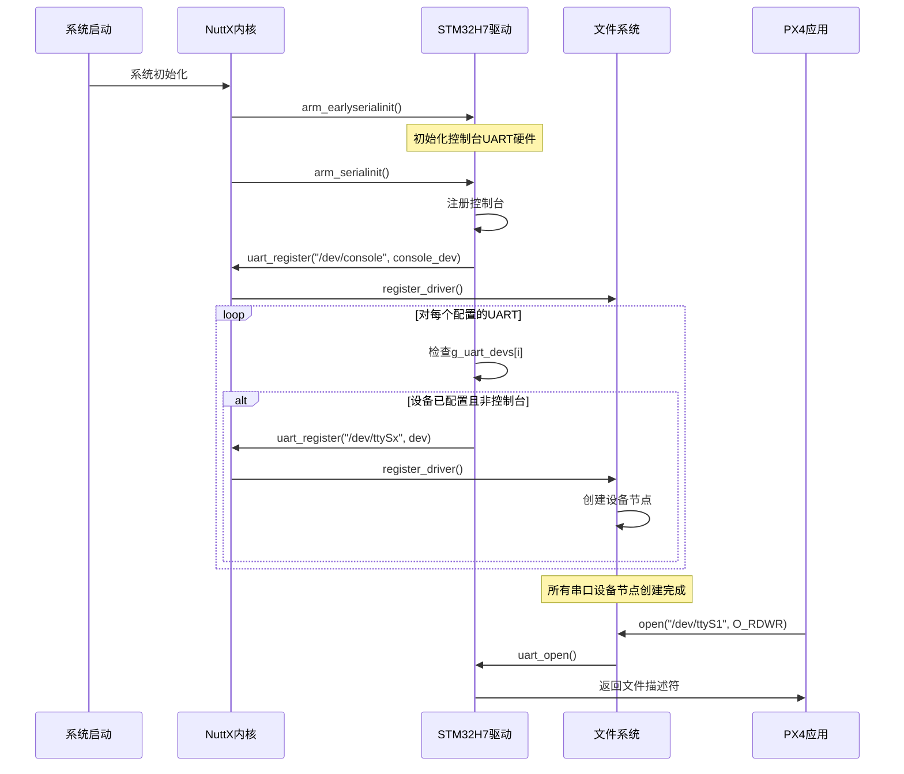

# PX4串口注册流程详解

## 概述

本文档详细分析PX4中串口设备的注册流程，从NuttX内核层面到PX4应用层面的完整过程。

## 注册流程架构

```
系统启动
    ↓
NuttX内核初始化
    ↓
arm_earlyserialinit() - 早期串口初始化
    ↓
arm_serialinit() - 串口设备注册
    ↓
uart_register() - 注册到文件系统
    ↓
/dev/ttyS* 设备节点创建
    ↓
PX4应用层访问
```

## 核心注册函数

### 1. uart_register() - 核心注册函数

**位置**: `platforms/nuttx/NuttX/nuttx/drivers/serial/serial.c`

```c
int uart_register(FAR const char *path, FAR uart_dev_t *dev)
{
    /* Initialize semaphores */
    nxsem_init(&dev->xmit.sem, 0, 1);
    nxsem_init(&dev->recv.sem, 0, 1);
    nxsem_init(&dev->closesem, 0, 1);
    nxsem_init(&dev->xmitsem,  0, 0);
    nxsem_init(&dev->recvsem,  0, 0);
    nxsem_init(&dev->pollsem,  0, 1);
    
    /* Register the serial driver */
    sinfo("Registering %s\n", path);
    return register_driver(path, &g_serialops, 0666, dev);
}
```

**功能**:
- 初始化串口设备的信号量
- 将串口驱动注册到NuttX文件系统
- 创建设备节点供应用程序访问

### 2. arm_serialinit() - 平台串口初始化

**位置**: `platforms/nuttx/NuttX/nuttx/arch/arm/src/stm32h7/stm32_serial.c`

```c
void arm_serialinit(void)
{
    char devname[16];
    unsigned i;
    unsigned minor = 0;
    
    /* Register the console */
    #if CONSOLE_UART > 0
    uart_register("/dev/console", &g_uart_devs[CONSOLE_UART - 1]->dev);
    
    #ifndef CONFIG_STM32H7_SERIAL_DISABLE_REORDERING
    /* Register the console UART to ttyS0 */
    uart_register("/dev/ttyS0", &g_uart_devs[CONSOLE_UART - 1]->dev);
    minor = 1;
    #endif
    #endif
    
    /* Register all remaining USARTs */
    strcpy(devname, "/dev/ttySx");
    
    for (i = 0; i < STM32_NSERIAL; i++) {
        /* Don't create a device for non-configured ports. */
        if (g_uart_devs[i] == 0) {
            continue;
        }
        
        /* Don't create a device for the console - we did that above */
        if (g_uart_devs[i]->dev.isconsole) {
            continue;
        }
        
        /* Register USARTs as devices in increasing order */
        devname[9] = '0' + minor++;
        uart_register(devname, &g_uart_devs[i]->dev);
    }
}
```

**功能**:
- 注册控制台设备 `/dev/console`
- 按顺序注册所有配置的串口为 `/dev/ttyS*`
- 跳过未配置和已注册的设备

## 设备数组定义

### STM32H7 UART设备数组

**位置**: `platforms/nuttx/NuttX/nuttx/arch/arm/src/stm32h7/stm32_serial.c`

```c
static struct up_dev_s * const g_uart_devs[STM32_NSERIAL] =
{
#ifdef CONFIG_STM32H7_USART1
  [0] = &g_usart1priv,    // 硬件USART1
#endif
#ifdef CONFIG_STM32H7_USART2  
  [1] = &g_usart2priv,    // 硬件USART2
#endif
#ifdef CONFIG_STM32H7_USART3
  [2] = &g_usart3priv,    // 硬件USART3
#endif
#ifdef CONFIG_STM32H7_UART4
  [3] = &g_uart4priv,     // 硬件UART4
#endif
#ifdef CONFIG_STM32H7_UART5
  [4] = &g_uart5priv,     // 硬件UART5
#endif
#ifdef CONFIG_STM32H7_USART6
  [5] = &g_usart6priv,    // 硬件USART6
#endif
#ifdef CONFIG_STM32H7_UART7
  [6] = &g_uart7priv,     // 硬件UART7
#endif
#ifdef CONFIG_STM32H7_UART8
  [7] = &g_uart8priv,     // 硬件UART8
#endif
};
```

**说明**:
- 数组索引与硬件UART编号不完全对应
- 只有在配置中启用的UART才会被包含
- 设备节点编号按数组中的顺序分配

## 注册时序图



## Fihawk FC-V1注册示例

### 配置文件设置

**位置**: `boards/fihawk/fc-v1/nuttx-config/nsh/defconfig`

```bash
# 启用的UART/USART
CONFIG_STM32H7_USART1=y    # 将被注册为某个ttyS
CONFIG_STM32H7_USART2=y    # 将被注册为某个ttyS
CONFIG_STM32H7_UART4=y     # 将被注册为某个ttyS
CONFIG_STM32H7_USART6=y    # 将被注册为某个ttyS
CONFIG_STM32H7_UART7=y     # 控制台 + 某个ttyS
CONFIG_STM32H7_UART8=y     # 将被注册为某个ttyS

# 控制台配置
CONFIG_UART7_SERIAL_CONSOLE=y

# 流控制配置
CONFIG_USART2_IFLOWCONTROL=y
CONFIG_USART2_OFLOWCONTROL=y
CONFIG_USART6_IFLOWCONTROL=y
CONFIG_USART6_OFLOWCONTROL=y
```

### 实际注册映射

| 数组索引 | 硬件UART | 配置宏 | 设备节点 | 功能 |
|---------|---------|--------|---------|------|
| [0] | USART1 | CONFIG_STM32H7_USART1 | /dev/ttyS0 | GPS1 |
| [1] | USART2 | CONFIG_STM32H7_USART2 | /dev/ttyS1 | TELEM1 |
| [3] | UART4 | CONFIG_STM32H7_UART4 | /dev/ttyS2 | GPS2 |
| [5] | USART6 | CONFIG_STM32H7_USART6 | /dev/ttyS3 | TELEM2 |
| [6] | UART7 | CONFIG_STM32H7_UART7 | /dev/console + /dev/ttyS4 | DEBUG |
| [7] | UART8 | CONFIG_STM32H7_UART8 | /dev/ttyS5 | RC |

**注意**: 
- UART7作为控制台，会同时注册为`/dev/console`和`/dev/ttyS4`
- 设备节点编号按照数组中非控制台设备的顺序分配
- 未配置的UART不会出现在设备节点中

## 注册过程详细分析

### 1. 早期初始化阶段

```c
void arm_earlyserialinit(void)
{
    unsigned i;
    
    /* Disable all USART interrupts */
    for (i = 0; i < STM32_NSERIAL; i++) {
        if (g_uart_devs[i]) {
            up_disableusartint(g_uart_devs[i], NULL);
        }
    }
    
    /* Configure whichever one is the console */
    #if CONSOLE_UART > 0
    up_setup(&g_uart_devs[CONSOLE_UART - 1]->dev);
    #endif
}
```

**目的**: 
- 禁用所有UART中断
- 配置控制台UART硬件
- 为后续注册做准备

### 2. 设备注册阶段

注册过程按以下顺序进行：

1. **控制台注册**: 首先注册`/dev/console`
2. **控制台ttyS注册**: 如果未禁用重排序，将控制台也注册为`/dev/ttyS0`
3. **其他设备注册**: 按数组顺序注册其他非控制台设备

### 3. 设备节点创建

每次调用`uart_register()`时：

1. 初始化设备信号量
2. 调用`register_driver()`注册到VFS
3. 创建对应的设备节点
4. 设置设备权限为0666

## 调试和验证

### 查看注册结果

```bash
# 查看所有串口设备节点
ls -la /dev/ttyS*

# 查看设备驱动信息
cat /proc/devices | grep tty

# 查看串口状态
listener serial_status
```

### 常见问题

1. **设备节点缺失**: 检查NuttX配置中对应的`CONFIG_STM32H7_UARTx`是否启用
2. **编号不对应**: 设备节点编号由数组顺序决定，不是硬件UART编号
3. **权限问题**: 设备节点权限为0666，确保应用有访问权限

## 总结

PX4的串口注册是一个自动化过程：

1. **配置驱动**: 通过NuttX配置启用所需的UART
2. **硬件初始化**: 在早期初始化阶段配置硬件
3. **设备注册**: 按顺序注册所有配置的串口
4. **节点创建**: 在文件系统中创建设备节点
5. **应用访问**: PX4应用通过标准文件操作访问串口

这个过程对PX4应用是透明的，应用只需要知道设备节点路径即可使用串口功能。
