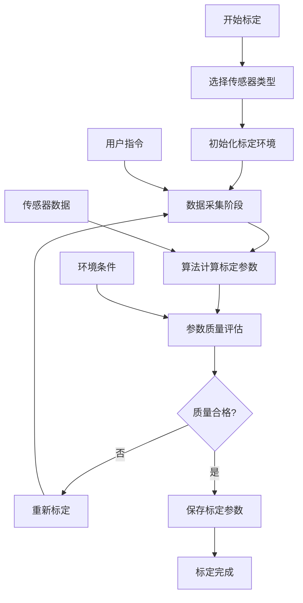

# PX4四旋翼传感器标定系统详解

## 文档概述

本文档详细介绍PX4四旋翼控制系统中的传感器标定机制，包括加速度计、陀螺仪、磁力计、气压计等主要传感器的标定原理、标定流程、标定算法以及质量评估方法。准确的传感器标定是飞行控制系统正常工作的前提条件。

## 传感器标定系统架构

### 标定系统组件

```
传感器标定系统架构
├── 标定管理器 (Calibration Manager)
│   ├── 标定流程控制
│   ├── 用户界面交互
│   ├── 标定状态管理
│   └── 参数存储管理
├── 加速度计标定
│   ├── 六面体标定算法
│   ├── 偏移和缩放估计
│   ├── 安装方向检测
│   └── 温度补偿标定
├── 陀螺仪标定
│   ├── 零偏标定算法
│   ├── 静态偏移估计
│   ├── 温度相关偏移
│   └── 缩放因子标定
├── 磁力计标定
│   ├── 椭球拟合算法
│   ├── 软硬铁校正
│   ├── 磁偏角计算
│   └── 干扰检测算法
└── 气压计标定
    ├── 海平面气压设定
    ├── 温度补偿
    ├── 高度基准校准
    └── 漂移监控
```

### 标定流程图



## 加速度计标定算法

### 六面体标定法

加速度计标定基于地球重力场，通过将设备放置在不同方向进行数据采集：

```cpp
class AccelerometerCalibrator {
public:
    struct CalibrationData {
        Vector3f offset;        // 偏移补偿 [m/s²]
        Matrix3f scale_matrix;  // 缩放矩阵
        float temperature;      // 标定温度 [°C]
        float quality_score;    // 质量评分
    };
    
    enum class CalibrationStep {
        STEP_WAITING = 0,
        STEP_COLLECT_FRONT,     // 前方向下
        STEP_COLLECT_BACK,      // 后方向下  
        STEP_COLLECT_RIGHT,     // 右方向下
        STEP_COLLECT_LEFT,      // 左方向下
        STEP_COLLECT_UP,        // 上方向下
        STEP_COLLECT_DOWN,      // 下方向下
        STEP_CALCULATE,         // 计算参数
        STEP_COMPLETE           // 标定完成
    };
    
    bool runCalibration() {
        switch (_calibration_step) {
        case CalibrationStep::STEP_WAITING:
            initializeCalibration();
            break;
            
        case CalibrationStep::STEP_COLLECT_FRONT:
        case CalibrationStep::STEP_COLLECT_BACK:
        case CalibrationStep::STEP_COLLECT_RIGHT:
        case CalibrationStep::STEP_COLLECT_LEFT:
        case CalibrationStep::STEP_COLLECT_UP:
        case CalibrationStep::STEP_COLLECT_DOWN:
            collectSampleData();
            break;
            
        case CalibrationStep::STEP_CALCULATE:
            calculateCalibrationParameters();
            break;
            
        case CalibrationStep::STEP_COMPLETE:
            saveCalibrationResults();
            return true;
        }
        
        return false;
    }
    
private:
    void collectSampleData() {
        if (isVehicleStable()) {
            // 收集当前方向的数据
            Vector3f accel_sample = getCurrentAcceleration();
            _sample_data[static_cast<int>(_calibration_step)].push_back(accel_sample);
            
            // 检查采样数量是否足够
            if (_sample_data[static_cast<int>(_calibration_step)].size() >= MIN_SAMPLES_PER_SIDE) {
                advanceToNextStep();
            }
        }
    }
    
    void calculateCalibrationParameters() {
        // 六面体标定算法
        SixPositionCalibration calibration;
        
        // 为每个面计算平均值
        Vector3f side_averages[6];
        for (int i = 0; i < 6; i++) {
            side_averages[i] = calculateAverage(_sample_data[i]);
        }
        
        // 求解标定参数
        CalibrationData result = calibration.solve(side_averages);
        
        // 质量评估
        result.quality_score = evaluateCalibrationQuality(result, side_averages);
        
        if (result.quality_score > QUALITY_THRESHOLD) {
            _calibration_result = result;
            _calibration_step = CalibrationStep::STEP_COMPLETE;
        } else {
            // 质量不合格，重新开始
            _calibration_step = CalibrationStep::STEP_WAITING;
        }
    }
    
    bool isVehicleStable() {
        // 检查飞行器是否稳定（用于数据采集）
        Vector3f current_accel = getCurrentAcceleration();
        
        // 计算加速度变化率
        float accel_change = (current_accel - _prev_accel).norm();
        _prev_accel = current_accel;
        
        // 加速度幅值应该接近重力加速度
        float accel_magnitude = current_accel.norm();
        bool magnitude_ok = abs(accel_magnitude - CONSTANTS_ONE_G) < STABILITY_THRESHOLD_MAGNITUDE;
        
        // 变化率应该很小
        bool change_rate_ok = accel_change < STABILITY_THRESHOLD_RATE;
        
        return magnitude_ok && change_rate_ok;
    }

private:
    CalibrationStep _calibration_step = CalibrationStep::STEP_WAITING;
    std::vector<Vector3f> _sample_data[6];  // 六个面的采样数据
    CalibrationData _calibration_result;
    Vector3f _prev_accel;
    
    static constexpr int MIN_SAMPLES_PER_SIDE = 50;
    static constexpr float QUALITY_THRESHOLD = 0.8f;
    static constexpr float STABILITY_THRESHOLD_MAGNITUDE = 2.0f;  // [m/s²]
    static constexpr float STABILITY_THRESHOLD_RATE = 0.5f;       // [m/s²]
};
```

### 椭球拟合算法

```cpp
class EllipsoidFitter {
public:
    struct EllipsoidParameters {
        Vector3f center;        // 椭球中心（偏移）
        Matrix3f shape_matrix;  // 椭球形状矩阵
        float residual_error;   // 拟合残差
    };
    
    EllipsoidParameters fitEllipsoid(const std::vector<Vector3f>& data_points) {
        if (data_points.size() < MIN_DATA_POINTS) {
            PX4_ERR("Insufficient data points for ellipsoid fitting");
            return EllipsoidParameters{};
        }
        
        // 构建方程组：数据点满足椭球方程
        // (x-x0)^T * A * (x-x0) = 1
        MatrixXf A = buildEllipsoidMatrix(data_points);
        VectorXf b = buildEllipsoidVector(data_points);
        
        // 最小二乘求解
        VectorXf solution = A.colPivHouseholderQr().solve(b);
        
        // 提取椭球参数
        EllipsoidParameters params = extractEllipsoidParameters(solution);
        
        // 计算拟合质量
        params.residual_error = calculateFittingError(data_points, params);
        
        return params;
    }
    
private:
    MatrixXf buildEllipsoidMatrix(const std::vector<Vector3f>& points) {
        int n = points.size();
        MatrixXf A(n, 9);  // 椭球的9个参数
        
        for (int i = 0; i < n; i++) {
            const Vector3f& p = points[i];
            
            A(i, 0) = p(0) * p(0);    // x²
            A(i, 1) = p(1) * p(1);    // y²
            A(i, 2) = p(2) * p(2);    // z²
            A(i, 3) = 2 * p(0) * p(1); // 2xy
            A(i, 4) = 2 * p(0) * p(2); // 2xz
            A(i, 5) = 2 * p(1) * p(2); // 2yz
            A(i, 6) = 2 * p(0);       // 2x
            A(i, 7) = 2 * p(1);       // 2y
            A(i, 8) = 2 * p(2);       // 2z
        }
        
        return A;
    }
    
    EllipsoidParameters extractEllipsoidParameters(const VectorXf& solution) {
        EllipsoidParameters params;
        
        // 重构椭球方程的系数矩阵
        Matrix4f Q = Matrix4f::Zero();
        Q(0,0) = solution(0);  // x²系数
        Q(1,1) = solution(1);  // y²系数
        Q(2,2) = solution(2);  // z²系数
        Q(0,1) = Q(1,0) = solution(3);  // xy系数
        Q(0,2) = Q(2,0) = solution(4);  // xz系数
        Q(1,2) = Q(2,1) = solution(5);  // yz系数
        Q(0,3) = Q(3,0) = solution(6);  // x系数
        Q(1,3) = Q(3,1) = solution(7);  // y系数
        Q(2,3) = Q(3,2) = solution(8);  // z系数
        Q(3,3) = -1;  // 常数项
        
        // 计算椭球中心
        Matrix3f A_sub = Q.block<3,3>(0,0);
        Vector3f b_sub = Q.block<3,1>(0,3);
        params.center = -0.5f * A_sub.inverse() * b_sub;
        
        // 计算形状矩阵
        params.shape_matrix = A_sub;
        
        return params;
    }

private:
    static constexpr int MIN_DATA_POINTS = 20;
};
```

## 陀螺仪标定算法

### 零偏标定

```cpp
class GyroscopeCalibrator {
public:
    struct GyroCalibrationData {
        Vector3f zero_offset;      // 零偏 [rad/s]
        Matrix3f scale_matrix;     // 缩放矩阵
        Vector3f temperature_coeff; // 温度系数 [rad/s/°C]
        float noise_level;         // 噪声水平 [rad/s]
        bool calibration_valid;    // 标定有效性
    };
    
    bool calibrateGyroscope() {
        PX4_INFO("Starting gyroscope calibration");
        
        // 1. 初始化标定
        initializeCalibration();
        
        // 2. 检查静止条件
        if (!checkStationaryCondition()) {
            PX4_ERR("Vehicle must be stationary for gyro calibration");
            return false;
        }
        
        // 3. 数据采集
        std::vector<GyroSample> samples;
        if (!collectGyroSamples(samples)) {
            PX4_ERR("Failed to collect gyro samples");
            return false;
        }
        
        // 4. 计算零偏
        GyroCalibrationData result = calculateZeroBias(samples);
        
        // 5. 质量评估
        if (!validateCalibrationQuality(result)) {
            PX4_ERR("Gyro calibration quality insufficient");
            return false;
        }
        
        // 6. 保存结果
        saveGyroCalibrationData(result);
        
        PX4_INFO("Gyroscope calibration completed successfully");
        return true;
    }
    
private:
    struct GyroSample {
        Vector3f angular_rate;
        float temperature;
        uint64_t timestamp;
    };
    
    bool collectGyroSamples(std::vector<GyroSample>& samples) {
        samples.clear();
        samples.reserve(CALIBRATION_SAMPLE_COUNT);
        
        uint64_t start_time = hrt_absolute_time();
        uint64_t timeout = start_time + CALIBRATION_TIMEOUT_US;
        
        while (samples.size() < CALIBRATION_SAMPLE_COUNT && 
               hrt_absolute_time() < timeout) {
            
            GyroSample sample;
            
            // 获取当前陀螺仪数据
            if (getGyroSample(sample)) {
                // 检查数据有效性
                if (isValidGyroSample(sample)) {
                    samples.push_back(sample);
                }
            }
            
            px4_usleep(SAMPLE_INTERVAL_US);
        }
        
        return samples.size() >= MIN_VALID_SAMPLES;
    }
    
    GyroCalibrationData calculateZeroBias(const std::vector<GyroSample>& samples) {
        GyroCalibrationData result{};
        
        // 计算平均零偏
        Vector3f bias_sum = Vector3f::Zero();
        float temp_sum = 0.0f;
        
        for (const auto& sample : samples) {
            bias_sum += sample.angular_rate;
            temp_sum += sample.temperature;
        }
        
        result.zero_offset = bias_sum / samples.size();
        float avg_temperature = temp_sum / samples.size();
        
        // 计算噪声水平
        result.noise_level = calculateNoiseLevel(samples, result.zero_offset);
        
        // 温度补偿（如果有多个温度点）
        result.temperature_coeff = calculateTemperatureCoefficient(samples);
        
        // 缩放矩阵（通常为单位矩阵，除非有专门的缩放标定）
        result.scale_matrix = Matrix3f::Identity();
        
        result.calibration_valid = true;
        
        return result;
    }
    
    float calculateNoiseLevel(const std::vector<GyroSample>& samples, 
                            const Vector3f& mean_bias) {
        float variance_sum = 0.0f;
        
        for (const auto& sample : samples) {
            Vector3f deviation = sample.angular_rate - mean_bias;
            variance_sum += deviation.norm_squared();
        }
        
        float variance = variance_sum / samples.size();
        return sqrt(variance);  // 返回标准差
    }
    
    Vector3f calculateTemperatureCoefficient(const std::vector<GyroSample>& samples) {
        // 简化实现：如果温度变化不大，返回零系数
        if (samples.empty()) return Vector3f::Zero();
        
        float min_temp = samples[0].temperature;
        float max_temp = samples[0].temperature;
        
        for (const auto& sample : samples) {
            min_temp = fmin(min_temp, sample.temperature);
            max_temp = fmax(max_temp, sample.temperature);
        }
        
        if (max_temp - min_temp < MIN_TEMP_RANGE_FOR_COEFF) {
            return Vector3f::Zero();
        }
        
        // 线性回归计算温度系数
        return performTemperatureLinearRegression(samples);
    }
    
    bool validateCalibrationQuality(const GyroCalibrationData& data) {
        // 检查零偏大小
        if (data.zero_offset.norm() > MAX_ACCEPTABLE_BIAS) {
            PX4_ERR("Gyro bias too large: %.3f rad/s", (double)data.zero_offset.norm());
            return false;
        }
        
        // 检查噪声水平
        if (data.noise_level > MAX_ACCEPTABLE_NOISE) {
            PX4_ERR("Gyro noise too high: %.3f rad/s", (double)data.noise_level);
            return false;
        }
        
        return true;
    }

private:
    static constexpr int CALIBRATION_SAMPLE_COUNT = 1000;
    static constexpr int MIN_VALID_SAMPLES = 500;
    static constexpr uint64_t CALIBRATION_TIMEOUT_US = 30000000;  // 30秒
    static constexpr uint32_t SAMPLE_INTERVAL_US = 10000;         // 10ms
    static constexpr float MAX_ACCEPTABLE_BIAS = 0.5f;            // [rad/s]
    static constexpr float MAX_ACCEPTABLE_NOISE = 0.1f;           // [rad/s]
    static constexpr float MIN_TEMP_RANGE_FOR_COEFF = 10.0f;      // [°C]
};
```

## 磁力计标定算法

### 椭球拟合法

磁力计标定需要补偿硬铁和软铁干扰：

```cpp
class MagnetometerCalibrator {
public:
    struct MagCalibrationData {
        Vector3f hard_iron_offset;    // 硬铁偏移 [Gauss]
        Matrix3f soft_iron_matrix;    // 软铁矩阵
        float magnetic_field_strength;// 磁场强度 [Gauss]
        float calibration_fitness;    // 拟合度 [0-1]
        uint32_t sample_count;        // 样本数量
    };
    
    enum class CalibrationStatus {
        NOT_STARTED,
        COLLECTING_DATA,
        CALCULATING,
        COMPLETED,
        FAILED
    };
    
    bool startCalibration() {
        PX4_INFO("Starting magnetometer calibration");
        
        // 清空之前的数据
        _sample_buffer.clear();
        _calibration_status = CalibrationStatus::COLLECTING_DATA;
        _start_time = hrt_absolute_time();
        
        return true;
    }
    
    void updateCalibration(const Vector3f& mag_sample) {
        if (_calibration_status != CalibrationStatus::COLLECTING_DATA) {
            return;
        }
        
        // 添加新样本
        addSample(mag_sample);
        
        // 检查是否收集足够样本
        if (_sample_buffer.size() >= MIN_SAMPLES_FOR_CALIBRATION) {
            // 检查样本分布是否充分
            if (hasSufficientSampleDistribution()) {
                _calibration_status = CalibrationStatus::CALCULATING;
                calculateCalibrationParameters();
            }
        }
        
        // 超时检查
        if (hrt_absolute_time() - _start_time > CALIBRATION_TIMEOUT_US) {
            PX4_WARN("Magnetometer calibration timeout");
            _calibration_status = CalibrationStatus::FAILED;
        }
    }
    
private:
    void addSample(const Vector3f& sample) {
        // 检查样本有效性
        if (isValidMagSample(sample)) {
            _sample_buffer.push_back(sample);
            
            // 限制缓冲区大小
            if (_sample_buffer.size() > MAX_SAMPLE_BUFFER_SIZE) {
                _sample_buffer.erase(_sample_buffer.begin());
            }
        }
    }
    
    bool hasSufficientSampleDistribution() {
        if (_sample_buffer.size() < MIN_SAMPLES_FOR_CALIBRATION) {
            return false;
        }
        
        // 检查样本在球面上的分布
        return checkSphericalDistribution(_sample_buffer);
    }
    
    bool checkSphericalDistribution(const std::vector<Vector3f>& samples) {
        // 将样本点投影到单位球面
        std::vector<Vector3f> normalized_samples;
        for (const auto& sample : samples) {
            Vector3f norm_sample = sample.normalized();
            normalized_samples.push_back(norm_sample);
        }
        
        // 检查各个方向上是否都有足够的样本
        int coverage_sectors[8] = {0};  // 8个象限
        
        for (const auto& sample : normalized_samples) {
            int sector = calculateSphericalSector(sample);
            coverage_sectors[sector]++;
        }
        
        // 每个象限至少需要一定数量的样本
        for (int i = 0; i < 8; i++) {
            if (coverage_sectors[i] < MIN_SAMPLES_PER_SECTOR) {
                return false;
            }
        }
        
        return true;
    }
    
    void calculateCalibrationParameters() {
        PX4_INFO("Calculating magnetometer calibration parameters");
        
        // 使用椭球拟合算法
        EllipsoidFitter fitter;
        EllipsoidFitter::EllipsoidParameters ellipsoid = 
            fitter.fitEllipsoid(_sample_buffer);
        
        if (ellipsoid.residual_error > MAX_FITTING_ERROR) {
            PX4_ERR("Magnetometer calibration fitting error too high");
            _calibration_status = CalibrationStatus::FAILED;
            return;
        }
        
        // 转换椭球参数为磁力计校正参数
        _calibration_result.hard_iron_offset = ellipsoid.center;
        
        // 计算软铁矩阵（将椭球转换为单位球）
        Eigen::SelfAdjointEigenSolver<Matrix3f> eigensolver(ellipsoid.shape_matrix);
        Vector3f eigenvalues = eigensolver.eigenvalues();
        Matrix3f eigenvectors = eigensolver.eigenvectors();
        
        // 构建软铁校正矩阵
        Vector3f scale_factors;
        for (int i = 0; i < 3; i++) {
            scale_factors(i) = sqrt(1.0f / eigenvalues(i));
        }
        
        _calibration_result.soft_iron_matrix = 
            eigenvectors * scale_factors.asDiagonal() * eigenvectors.transpose();
        
        // 计算拟合质量
        _calibration_result.calibration_fitness = calculateCalibrationFitness();
        _calibration_result.sample_count = _sample_buffer.size();
        
        // 验证标定质量
        if (_calibration_result.calibration_fitness > MIN_FITNESS_THRESHOLD) {
            _calibration_status = CalibrationStatus::COMPLETED;
            PX4_INFO("Magnetometer calibration successful (fitness: %.3f)", 
                    (double)_calibration_result.calibration_fitness);
        } else {
            _calibration_status = CalibrationStatus::FAILED;
            PX4_ERR("Magnetometer calibration fitness insufficient");
        }
    }
    
    float calculateCalibrationFitness() {
        // 应用标定参数到原始数据，计算校正后的方差
        std::vector<float> corrected_magnitudes;
        
        for (const auto& sample : _sample_buffer) {
            Vector3f corrected = _calibration_result.soft_iron_matrix * 
                               (sample - _calibration_result.hard_iron_offset);
            corrected_magnitudes.push_back(corrected.norm());
        }
        
        // 计算幅值方差（标定后应该接近常数）
        float mean_magnitude = 0.0f;
        for (float mag : corrected_magnitudes) {
            mean_magnitude += mag;
        }
        mean_magnitude /= corrected_magnitudes.size();
        
        float variance = 0.0f;
        for (float mag : corrected_magnitudes) {
            variance += (mag - mean_magnitude) * (mag - mean_magnitude);
        }
        variance /= corrected_magnitudes.size();
        
        // 标准差相对于平均值的比例（越小越好）
        float coefficient_of_variation = sqrt(variance) / mean_magnitude;
        
        // 转换为适应度分数（0-1，越大越好）
        return exp(-coefficient_of_variation * 10.0f);
    }

private:
    std::vector<Vector3f> _sample_buffer;
    MagCalibrationData _calibration_result;
    CalibrationStatus _calibration_status = CalibrationStatus::NOT_STARTED;
    uint64_t _start_time;
    
    static constexpr int MIN_SAMPLES_FOR_CALIBRATION = 300;
    static constexpr int MAX_SAMPLE_BUFFER_SIZE = 1000;
    static constexpr int MIN_SAMPLES_PER_SECTOR = 20;
    static constexpr uint64_t CALIBRATION_TIMEOUT_US = 120000000;  // 2分钟
    static constexpr float MAX_FITTING_ERROR = 0.2f;
    static constexpr float MIN_FITNESS_THRESHOLD = 0.8f;
};
```

### 磁偏角计算

```cpp
class MagneticDeclinationCalculator {
public:
    struct GeomagneticModel {
        float declination;      // 磁偏角 [度]
        float inclination;      // 磁倾角 [度]
        float intensity;        // 磁场强度 [nT]
        float horizontal_comp;  // 水平分量 [nT]
        float vertical_comp;    // 垂直分量 [nT]
    };
    
    GeomagneticModel calculateMagneticModel(double latitude, double longitude, 
                                          double altitude_msl, uint64_t timestamp) {
        GeomagneticModel model{};
        
        // 转换时间为十进制年份
        double decimal_year = timestampToDecimalYear(timestamp);
        
        // 使用WMM（世界磁模型）计算
        WMMCalculator wmm_calc;
        model = wmm_calc.calculate(latitude, longitude, altitude_msl, decimal_year);
        
        return model;
    }
    
    float getDeclination(double lat, double lon) {
        // 简化的磁偏角查找表实现
        return lookupDeclination(lat, lon);
    }
    
private:
    double timestampToDecimalYear(uint64_t timestamp_us) {
        // 转换微秒时间戳为十进制年份
        time_t seconds = timestamp_us / 1000000;
        struct tm* time_info = gmtime(&seconds);
        
        double decimal_year = 1900 + time_info->tm_year;
        decimal_year += (time_info->tm_yday + 1) / 365.25;
        
        return decimal_year;
    }
    
    float lookupDeclination(double lat, double lon) {
        // 磁偏角查找表（简化版）
        // 实际实现中使用完整的WMM模型
        static const struct DeclinationTableEntry {
            float lat_min, lat_max;
            float lon_min, lon_max;
            float declination;
        } declination_table[] = {
            // 中国区域示例数据
            {20.0f, 40.0f, 100.0f, 130.0f, -5.0f},  // 华南、华东
            {40.0f, 50.0f, 80.0f, 120.0f, -2.0f},   // 华北、西北
            // 添加更多区域...
        };
        
        for (const auto& entry : declination_table) {
            if (lat >= entry.lat_min && lat <= entry.lat_max &&
                lon >= entry.lon_min && lon <= entry.lon_max) {
                return entry.declination;
            }
        }
        
        return 0.0f;  // 默认值
    }
};
```

## 气压计标定算法

### 海平面气压标定

```cpp
class BarometerCalibrator {
public:
    struct BaroCalibrationData {
        float ground_pressure;      // 地面气压 [Pa]
        float sea_level_pressure;   // 海平面气压 [Pa]
        float reference_altitude;   // 参考高度 [m]
        float temperature_coeff;    // 温度系数 [Pa/°C]
        bool altitude_reference_valid; // 高度基准有效性
    };
    
    bool calibrateBarometer(float reference_altitude = NAN) {
        PX4_INFO("Starting barometer calibration");
        
        // 收集气压数据
        std::vector<BaroSample> samples;
        if (!collectBaroSamples(samples)) {
            PX4_ERR("Failed to collect barometer samples");
            return false;
        }
        
        // 计算平均地面气压
        BaroCalibrationData result = calculateGroundPressure(samples);
        
        // 设置高度基准
        if (!isnan(reference_altitude)) {
            result.reference_altitude = reference_altitude;
            result.altitude_reference_valid = true;
            
            // 计算海平面气压
            result.sea_level_pressure = calculateSeaLevelPressure(
                result.ground_pressure, reference_altitude);
        } else {
            // 使用标准大气压
            result.sea_level_pressure = STANDARD_ATMOSPHERIC_PRESSURE;
            result.altitude_reference_valid = false;
        }
        
        // 保存标定结果
        saveBaroCalibrationData(result);
        
        PX4_INFO("Barometer calibration completed");
        return true;
    }
    
private:
    struct BaroSample {
        float pressure;      // 气压 [Pa]
        float temperature;   // 温度 [°C]
        uint64_t timestamp;  // 时间戳
    };
    
    bool collectBaroSamples(std::vector<BaroSample>& samples) {
        samples.clear();
        samples.reserve(CALIBRATION_SAMPLE_COUNT);
        
        for (int i = 0; i < CALIBRATION_SAMPLE_COUNT; i++) {
            BaroSample sample;
            
            if (getBaroSample(sample)) {
                samples.push_back(sample);
            }
            
            px4_usleep(SAMPLE_INTERVAL_US);
        }
        
        return samples.size() >= MIN_VALID_SAMPLES;
    }
    
    BaroCalibrationData calculateGroundPressure(const std::vector<BaroSample>& samples) {
        BaroCalibrationData result{};
        
        if (samples.empty()) return result;
        
        // 计算平均压力
        double pressure_sum = 0.0;
        double temperature_sum = 0.0;
        
        for (const auto& sample : samples) {
            pressure_sum += sample.pressure;
            temperature_sum += sample.temperature;
        }
        
        result.ground_pressure = pressure_sum / samples.size();
        float avg_temperature = temperature_sum / samples.size();
        
        // 计算压力标准差（评估数据质量）
        double pressure_variance = 0.0;
        for (const auto& sample : samples) {
            double deviation = sample.pressure - result.ground_pressure;
            pressure_variance += deviation * deviation;
        }
        pressure_variance /= samples.size();
        float pressure_std = sqrt(pressure_variance);
        
        // 检查数据质量
        if (pressure_std > MAX_PRESSURE_NOISE) {
            PX4_WARN("High pressure noise detected: %.2f Pa", (double)pressure_std);
        }
        
        return result;
    }
    
    float calculateSeaLevelPressure(float ground_pressure, float altitude) {
        // 使用国际标准大气公式
        // P0 = P * (1 - 0.0065 * h / (T0 + 0.0065 * h))^(-5.257)
        // 简化公式：P0 = P * (1 + h/44330)^5.255
        
        float pressure_ratio = pow(1.0f + altitude / 44330.0f, 5.255f);
        return ground_pressure * pressure_ratio;
    }

private:
    static constexpr int CALIBRATION_SAMPLE_COUNT = 200;
    static constexpr int MIN_VALID_SAMPLES = 100;
    static constexpr uint32_t SAMPLE_INTERVAL_US = 50000;    // 50ms
    static constexpr float MAX_PRESSURE_NOISE = 50.0f;      // Pa
    static constexpr float STANDARD_ATMOSPHERIC_PRESSURE = 101325.0f;  // Pa
};
```

## 标定质量评估

### 多指标评估系统

```cpp
class CalibrationQualityAssessor {
public:
    struct QualityMetrics {
        float completeness;      // 完整性评分 [0-1]
        float accuracy;          // 准确性评分 [0-1]
        float consistency;       // 一致性评分 [0-1]
        float stability;         // 稳定性评分 [0-1]
        float overall_score;     // 综合评分 [0-1]
        bool meets_requirements; // 是否满足要求
    };
    
    QualityMetrics assessCalibrationQuality(SensorType sensor_type,
                                          const CalibrationResult& result) {
        QualityMetrics metrics{};
        
        switch (sensor_type) {
        case SensorType::ACCELEROMETER:
            metrics = assessAccelCalibration(result.accel_data);
            break;
        case SensorType::GYROSCOPE:
            metrics = assessGyroCalibration(result.gyro_data);
            break;
        case SensorType::MAGNETOMETER:
            metrics = assessMagCalibration(result.mag_data);
            break;
        case SensorType::BAROMETER:
            metrics = assessBaroCalibration(result.baro_data);
            break;
        }
        
        // 计算综合评分
        metrics.overall_score = calculateOverallScore(metrics);
        metrics.meets_requirements = (metrics.overall_score > MIN_ACCEPTABLE_SCORE);
        
        return metrics;
    }
    
private:
    QualityMetrics assessAccelCalibration(const AccelCalibrationData& data) {
        QualityMetrics metrics{};
        
        // 1. 完整性评估：检查是否有六个方向的数据
        metrics.completeness = 1.0f;  // 假设已完成六面标定
        
        // 2. 准确性评估：基于重力幅值的一致性
        float gravity_error = abs(data.calibrated_gravity_magnitude - CONSTANTS_ONE_G);
        metrics.accuracy = exp(-gravity_error / GRAVITY_ERROR_SCALE);
        
        // 3. 一致性评估：各轴间的一致性
        metrics.consistency = assessAccelConsistency(data);
        
        // 4. 稳定性评估：标定参数的稳定性
        metrics.stability = assessAccelStability(data);
        
        return metrics;
    }
    
    QualityMetrics assessGyroCalibration(const GyroCalibrationData& data) {
        QualityMetrics metrics{};
        
        // 零偏大小评估
        float bias_magnitude = data.zero_offset.norm();
        metrics.accuracy = exp(-bias_magnitude / GYRO_BIAS_SCALE);
        
        // 噪声水平评估
        metrics.stability = exp(-data.noise_level / GYRO_NOISE_SCALE);
        
        // 完整性和一致性
        metrics.completeness = 1.0f;
        metrics.consistency = 1.0f;
        
        return metrics;
    }
    
    QualityMetrics assessMagCalibration(const MagCalibrationData& data) {
        QualityMetrics metrics{};
        
        // 拟合质量
        metrics.accuracy = data.calibration_fitness;
        
        // 样本数量完整性
        metrics.completeness = math::constrain(
            (float)data.sample_count / MIN_MAG_SAMPLES, 0.0f, 1.0f);
        
        // 硬铁偏移合理性
        float hard_iron_magnitude = data.hard_iron_offset.norm();
        metrics.consistency = exp(-hard_iron_magnitude / HARD_IRON_SCALE);
        
        // 软铁矩阵条件数
        metrics.stability = assessSoftIronStability(data.soft_iron_matrix);
        
        return metrics;
    }
    
    float calculateOverallScore(const QualityMetrics& metrics) {
        // 加权平均
        float weights[4] = {0.3f, 0.4f, 0.2f, 0.1f};  // 准确性权重最高
        
        return weights[0] * metrics.completeness +
               weights[1] * metrics.accuracy +
               weights[2] * metrics.consistency +
               weights[3] * metrics.stability;
    }
    
    float assessSoftIronStability(const Matrix3f& soft_iron_matrix) {
        // 计算矩阵条件数
        Eigen::JacobiSVD<Matrix3f> svd(soft_iron_matrix);
        Vector3f singular_values = svd.singularValues();
        
        float condition_number = singular_values.maxCoeff() / singular_values.minCoeff();
        
        // 条件数越小越稳定
        return exp(-condition_number / CONDITION_NUMBER_SCALE);
    }

private:
    static constexpr float MIN_ACCEPTABLE_SCORE = 0.7f;
    static constexpr float GRAVITY_ERROR_SCALE = 2.0f;      // [m/s²]
    static constexpr float GYRO_BIAS_SCALE = 0.1f;          // [rad/s]
    static constexpr float GYRO_NOISE_SCALE = 0.05f;        // [rad/s]
    static constexpr float HARD_IRON_SCALE = 100.0f;        // [Gauss]
    static constexpr float CONDITION_NUMBER_SCALE = 5.0f;
    static constexpr int MIN_MAG_SAMPLES = 300;
};
```

## 温度补偿标定

### 传感器温度特性建模

```cpp
class TemperatureCompensationCalibrator {
public:
    struct TempCompensationModel {
        Vector3f offset_at_ref_temp;     // 参考温度下的偏移
        Vector3f temperature_slope;      // 温度斜率 [unit/°C]
        Vector3f temperature_curve;      // 二次项系数 [unit/°C²]
        float reference_temperature;     // 参考温度 [°C]
        float temperature_range_min;     // 标定温度范围最小值
        float temperature_range_max;     // 标定温度范围最大值
        bool valid;                      // 模型有效性
    };
    
    bool calibrateTemperatureCompensation(SensorType sensor_type) {
        PX4_INFO("Starting temperature compensation calibration for sensor %d", 
                static_cast<int>(sensor_type));
        
        // 收集多温度点数据
        std::map<float, std::vector<Vector3f>> temperature_data;
        if (!collectMultiTemperatureData(sensor_type, temperature_data)) {
            PX4_ERR("Failed to collect temperature data");
            return false;
        }
        
        // 建立温度补偿模型
        TempCompensationModel model = buildTemperatureModel(temperature_data);
        
        if (!model.valid) {
            PX4_ERR("Failed to build temperature compensation model");
            return false;
        }
        
        // 保存模型参数
        saveTempCompensationModel(sensor_type, model);
        
        PX4_INFO("Temperature compensation calibration completed");
        return true;
    }
    
private:
    bool collectMultiTemperatureData(SensorType sensor_type,
                                   std::map<float, std::vector<Vector3f>>& temp_data) {
        uint64_t start_time = hrt_absolute_time();
        float last_recorded_temp = -999.0f;
        
        while (hrt_absolute_time() - start_time < TEMPERATURE_CALIBRATION_TIMEOUT_US) {
            float current_temp = getCurrentTemperature();
            Vector3f sensor_data = getSensorData(sensor_type);
            
            // 每2度记录一次数据
            if (abs(current_temp - last_recorded_temp) > TEMPERATURE_STEP_SIZE) {
                temp_data[current_temp].push_back(sensor_data);
                last_recorded_temp = current_temp;
                
                PX4_INFO("Recorded data at %.1f°C", (double)current_temp);
            }
            
            px4_usleep(100000);  // 100ms间隔
        }
        
        // 检查温度覆盖范围
        if (temp_data.size() < MIN_TEMPERATURE_POINTS) {
            PX4_ERR("Insufficient temperature points: %d", (int)temp_data.size());
            return false;
        }
        
        auto temp_range = std::minmax_element(temp_data.begin(), temp_data.end());
        float temp_span = temp_range.second->first - temp_range.first->first;
        
        if (temp_span < MIN_TEMPERATURE_RANGE) {
            PX4_ERR("Temperature range too small: %.1f°C", (double)temp_span);
            return false;
        }
        
        return true;
    }
    
    TempCompensationModel buildTemperatureModel(
        const std::map<float, std::vector<Vector3f>>& temp_data) {
        
        TempCompensationModel model{};
        model.reference_temperature = REFERENCE_TEMPERATURE;
        
        // 为每个轴建立温度模型
        for (int axis = 0; axis < 3; axis++) {
            // 准备回归数据
            std::vector<float> temperatures;
            std::vector<float> sensor_values;
            
            for (const auto& temp_point : temp_data) {
                float temperature = temp_point.first;
                
                // 计算该温度下的平均传感器值
                Vector3f avg_sensor_data = Vector3f::Zero();
                for (const auto& sample : temp_point.second) {
                    avg_sensor_data += sample;
                }
                avg_sensor_data /= temp_point.second.size();
                
                temperatures.push_back(temperature);
                sensor_values.push_back(avg_sensor_data(axis));
            }
            
            // 多项式回归（二次）
            PolynomialRegressor regressor(2);  // 二次多项式
            auto coefficients = regressor.fit(temperatures, sensor_values);
            
            if (coefficients.size() >= 3) {
                model.offset_at_ref_temp(axis) = coefficients[0] + 
                    coefficients[1] * REFERENCE_TEMPERATURE +
                    coefficients[2] * REFERENCE_TEMPERATURE * REFERENCE_TEMPERATURE;
                    
                model.temperature_slope(axis) = coefficients[1] + 
                    2 * coefficients[2] * REFERENCE_TEMPERATURE;
                    
                model.temperature_curve(axis) = coefficients[2];
            }
        }
        
        // 设置温度范围
        auto temp_range = std::minmax_element(temp_data.begin(), temp_data.end());
        model.temperature_range_min = temp_range.first->first;
        model.temperature_range_max = temp_range.second->first;
        model.valid = true;
        
        return model;
    }
    
    Vector3f applyTemperatureCompensation(const Vector3f& raw_data, 
                                        float temperature,
                                        const TempCompensationModel& model) {
        if (!model.valid) return raw_data;
        
        float temp_diff = temperature - model.reference_temperature;
        
        Vector3f compensation = model.temperature_slope * temp_diff +
                               model.temperature_curve * (temp_diff * temp_diff);
        
        return raw_data - compensation;
    }

private:
    static constexpr uint64_t TEMPERATURE_CALIBRATION_TIMEOUT_US = 3600000000;  // 1小时
    static constexpr float TEMPERATURE_STEP_SIZE = 2.0f;        // [°C]
    static constexpr int MIN_TEMPERATURE_POINTS = 5;
    static constexpr float MIN_TEMPERATURE_RANGE = 20.0f;       // [°C]
    static constexpr float REFERENCE_TEMPERATURE = 25.0f;       // [°C]
};
```

## 标定数据管理

### 参数存储系统

```cpp
class CalibrationParameterManager {
public:
    struct CalibrationParameters {
        // 加速度计参数
        Vector3f accel_offset[MAX_ACCEL_COUNT];
        Matrix3f accel_scale[MAX_ACCEL_COUNT];
        
        // 陀螺仪参数
        Vector3f gyro_offset[MAX_GYRO_COUNT];
        Matrix3f gyro_scale[MAX_GYRO_COUNT];
        
        // 磁力计参数
        Vector3f mag_offset[MAX_MAG_COUNT];
        Matrix3f mag_scale[MAX_MAG_COUNT];
        
        // 气压计参数
        float baro_offset[MAX_BARO_COUNT];
        float baro_scale[MAX_BARO_COUNT];
        
        // 标定状态
        bool accel_calibrated[MAX_ACCEL_COUNT];
        bool gyro_calibrated[MAX_GYRO_COUNT];
        bool mag_calibrated[MAX_MAG_COUNT];
        bool baro_calibrated[MAX_BARO_COUNT];
        
        // 标定时间戳
        uint64_t calibration_timestamp[SENSOR_TYPE_COUNT];
    };
    
    bool saveCalibrationParameters(const CalibrationParameters& params) {
        // 保存到参数系统
        for (int i = 0; i < MAX_ACCEL_COUNT; i++) {
            if (params.accel_calibrated[i]) {
                saveAccelParameters(i, params.accel_offset[i], params.accel_scale[i]);
            }
        }
        
        for (int i = 0; i < MAX_GYRO_COUNT; i++) {
            if (params.gyro_calibrated[i]) {
                saveGyroParameters(i, params.gyro_offset[i], params.gyro_scale[i]);
            }
        }
        
        for (int i = 0; i < MAX_MAG_COUNT; i++) {
            if (params.mag_calibrated[i]) {
                saveMagParameters(i, params.mag_offset[i], params.mag_scale[i]);
            }
        }
        
        // 保存标定时间戳
        saveCalibrationTimestamps(params.calibration_timestamp);
        
        return true;
    }
    
    CalibrationParameters loadCalibrationParameters() {
        CalibrationParameters params{};
        
        // 从参数系统加载
        loadAccelParameters(params);
        loadGyroParameters(params);
        loadMagParameters(params);
        loadBaroParameters(params);
        
        return params;
    }
    
private:
    void saveAccelParameters(int instance, const Vector3f& offset, const Matrix3f& scale) {
        char param_name[32];
        
        // 保存偏移参数
        snprintf(param_name, sizeof(param_name), "CAL_ACC%d_XOFF", instance);
        param_set(param_find(param_name), &offset(0));
        
        snprintf(param_name, sizeof(param_name), "CAL_ACC%d_YOFF", instance);
        param_set(param_find(param_name), &offset(1));
        
        snprintf(param_name, sizeof(param_name), "CAL_ACC%d_ZOFF", instance);
        param_set(param_find(param_name), &offset(2));
        
        // 保存缩放参数
        snprintf(param_name, sizeof(param_name), "CAL_ACC%d_XSCALE", instance);
        param_set(param_find(param_name), &scale(0,0));
        
        snprintf(param_name, sizeof(param_name), "CAL_ACC%d_YSCALE", instance);
        param_set(param_find(param_name), &scale(1,1));
        
        snprintf(param_name, sizeof(param_name), "CAL_ACC%d_ZSCALE", instance);
        param_set(param_find(param_name), &scale(2,2));
    }

private:
    static constexpr int MAX_ACCEL_COUNT = 3;
    static constexpr int MAX_GYRO_COUNT = 3;
    static constexpr int MAX_MAG_COUNT = 3;
    static constexpr int MAX_BARO_COUNT = 3;
    static constexpr int SENSOR_TYPE_COUNT = 4;
};
```

## 标定验证测试

### 自动验证系统

```cpp
class CalibrationValidator {
public:
    struct ValidationResults {
        bool accel_validation_passed;
        bool gyro_validation_passed;
        bool mag_validation_passed;
        bool baro_validation_passed;
        float overall_confidence;
        std::string validation_report;
    };
    
    ValidationResults validateCalibration() {
        ValidationResults results{};
        
        PX4_INFO("Starting calibration validation");
        
        // 验证加速度计标定
        results.accel_validation_passed = validateAccelerometerCalibration();
        
        // 验证陀螺仪标定
        results.gyro_validation_passed = validateGyroscopeCalibration();
        
        // 验证磁力计标定
        results.mag_validation_passed = validateMagnetometerCalibration();
        
        // 验证气压计标定
        results.baro_validation_passed = validateBarometerCalibration();
        
        // 计算总体置信度
        results.overall_confidence = calculateOverallConfidence(results);
        
        // 生成验证报告
        results.validation_report = generateValidationReport(results);
        
        return results;
    }
    
private:
    bool validateAccelerometerCalibration() {
        // 收集静态数据
        std::vector<Vector3f> static_samples;
        collectStaticAccelData(static_samples);
        
        if (static_samples.empty()) return false;
        
        // 计算重力幅值统计
        std::vector<float> magnitudes;
        for (const auto& sample : static_samples) {
            magnitudes.push_back(sample.norm());
        }
        
        float mean_magnitude = calculateMean(magnitudes);
        float std_magnitude = calculateStdDev(magnitudes, mean_magnitude);
        
        // 验证标准
        bool magnitude_ok = abs(mean_magnitude - CONSTANTS_ONE_G) < GRAVITY_TOLERANCE;
        bool consistency_ok = std_magnitude < GRAVITY_CONSISTENCY_TOLERANCE;
        
        if (magnitude_ok && consistency_ok) {
            PX4_INFO("Accelerometer calibration validated");
            return true;
        } else {
            PX4_WARN("Accelerometer calibration validation failed");
            return false;
        }
    }
    
    bool validateGyroscopeCalibration() {
        // 收集静止状态数据
        std::vector<Vector3f> static_gyro_samples;
        collectStaticGyroData(static_gyro_samples);
        
        if (static_gyro_samples.empty()) return false;
        
        // 计算平均偏移
        Vector3f mean_gyro = Vector3f::Zero();
        for (const auto& sample : static_gyro_samples) {
            mean_gyro += sample;
        }
        mean_gyro /= static_gyro_samples.size();
        
        // 验证偏移是否在合理范围内
        bool bias_ok = mean_gyro.norm() < GYRO_BIAS_TOLERANCE;
        
        if (bias_ok) {
            PX4_INFO("Gyroscope calibration validated");
            return true;
        } else {
            PX4_WARN("Gyroscope calibration validation failed");
            return false;
        }
    }
    
    bool validateMagnetometerCalibration() {
        // 收集多方向磁力计数据
        std::vector<Vector3f> mag_samples;
        collectRotationalMagData(mag_samples);
        
        if (mag_samples.size() < MIN_MAG_VALIDATION_SAMPLES) return false;
        
        // 计算校正后的磁场强度一致性
        std::vector<float> field_strengths;
        for (const auto& sample : mag_samples) {
            field_strengths.push_back(sample.norm());
        }
        
        float mean_strength = calculateMean(field_strengths);
        float std_strength = calculateStdDev(field_strengths, mean_strength);
        
        // 一致性验证
        float coefficient_of_variation = std_strength / mean_strength;
        bool consistency_ok = coefficient_of_variation < MAG_CONSISTENCY_TOLERANCE;
        
        if (consistency_ok) {
            PX4_INFO("Magnetometer calibration validated");
            return true;
        } else {
            PX4_WARN("Magnetometer calibration validation failed");
            return false;
        }
    }
    
    float calculateOverallConfidence(const ValidationResults& results) {
        int passed_count = 0;
        int total_count = 4;
        
        if (results.accel_validation_passed) passed_count++;
        if (results.gyro_validation_passed) passed_count++;
        if (results.mag_validation_passed) passed_count++;
        if (results.baro_validation_passed) passed_count++;
        
        return (float)passed_count / total_count;
    }

private:
    static constexpr float GRAVITY_TOLERANCE = 1.0f;                // [m/s²]
    static constexpr float GRAVITY_CONSISTENCY_TOLERANCE = 0.5f;    // [m/s²]
    static constexpr float GYRO_BIAS_TOLERANCE = 0.1f;              // [rad/s]
    static constexpr float MAG_CONSISTENCY_TOLERANCE = 0.1f;        // 变异系数
    static constexpr int MIN_MAG_VALIDATION_SAMPLES = 50;
};
```

## 代码文件索引

### 核心标定文件

| 功能模块 | 文件位置 | 主要功能 |
|---------|----------|----------|
| 标定管理器 | `src/modules/commander/calibration_routines.cpp` | 标定流程控制 |
| 加速度计标定 | `src/modules/commander/accelerometer_calibration.cpp` | 六面体标定算法 |
| 陀螺仪标定 | `src/modules/commander/gyro_calibration.cpp` | 零偏标定算法 |
| 磁力计标定 | `src/modules/commander/mag_calibration.cpp` | 椭球拟合算法 |

### 标定参数

| 参数名称 | 说明 | 典型值 |
|---------|------|--------|
| CAL_ACC*_XOFF | 加速度计X轴偏移 | 0.0 [m/s²] |
| CAL_GYRO*_XOFF | 陀螺仪X轴偏移 | 0.0 [rad/s] |
| CAL_MAG*_XOFF | 磁力计X轴偏移 | 0.0 [Gauss] |
| SENS_BARO_QNH | 海平面气压 | 1013.25 [hPa] |

## 常见标定问题

### Q1: 加速度计标定失败

**症状**: 六面标定无法完成或精度不足

**可能原因**:
- 飞行器放置不稳定
- 环境振动过大
- 传感器硬件故障

**解决方案**:
```bash
# 重新标定前检查环境
commander calibrate accel

# 检查振动水平
listener vehicle_acceleration
```

### Q2: 磁力计标定困难

**症状**: 需要很长时间或无法达到足够精度

**解决方案**:
- 远离金属物体和电磁干扰源
- 确保在各个方向充分旋转
- 避免在室内进行标定

### Q3: 标定参数丢失

**症状**: 重新上电后标定参数恢复到默认值

**解决方案**:
```bash
# 保存参数到非易失存储
param save

# 检查参数保存状态
param status
```

---

**注意**: 传感器标定是飞行安全的基础，必须在安全环境下进行。标定完成后应进行充分的地面测试验证。