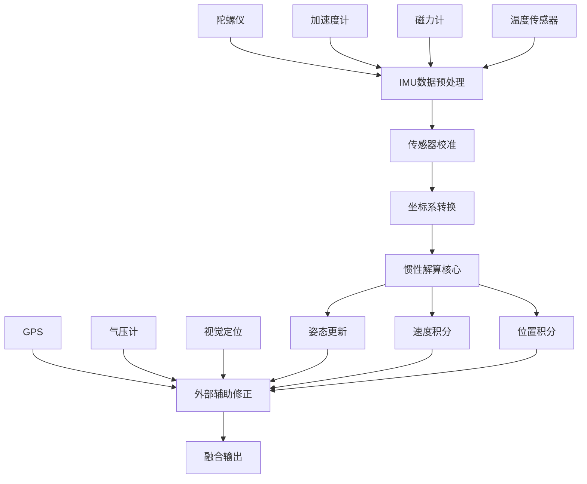

# PX4四旋翼惯性导航系统详解

## 文档概述

本文档详细介绍PX4四旋翼控制系统中的惯性导航系统（INS），包括惯性测量单元（IMU）数据处理、姿态解算、位置推算以及与其他导航系统的集成。惯性导航系统是飞行控制器的核心组成部分，为控制系统提供高频率的状态估计。

## 惯性导航系统架构

### 系统组件概览

```
惯性导航系统架构
├── IMU数据采集层
│   ├── 陀螺仪数据处理
│   ├── 加速度计数据处理
│   ├── 磁力计数据处理
│   └── 传感器标定补偿
├── 惯性解算层
│   ├── 姿态解算 (四元数)
│   ├── 速度积分
│   ├── 位置积分
│   └── 偏移估计
├── 外部辅助层
│   ├── GPS辅助修正
│   ├── 气压高度辅助
│   ├── 磁力计航向辅助
│   └── 视觉定位辅助
└── 输出接口层
    ├── 姿态输出 (vehicle_attitude)
    ├── 角速度输出 (vehicle_angular_velocity)
    ├── 加速度输出 (vehicle_acceleration)
    └── IMU状态输出 (vehicle_imu_status)
```

### 数据流程图



## IMU数据处理

### 传感器数据结构

```cpp
// IMU原始数据结构
struct imu_sample_t {
    uint64_t time_us;           // 时间戳
    Vector3f delta_ang;         // 角增量 [rad]
    Vector3f delta_vel;         // 速度增量 [m/s]
    float delta_ang_dt;         // 角速度采样时间
    float delta_vel_dt;         // 加速度采样时间
    uint32_t delta_ang_clipping;    // 陀螺仪削波标志
    uint32_t delta_vel_clipping;    // 加速度计削波标志
};

// 处理后的IMU数据
struct imu_data_t {
    Vector3f angular_velocity;   // 角速度 [rad/s]
    Vector3f linear_acceleration;// 线性加速度 [m/s²]
    Matrix3f rotation_matrix;    // 旋转矩阵
    Quatf attitude_quaternion;   // 姿态四元数
};
```

### IMU数据预处理

```cpp
class IMUPreprocessor {
public:
    void processRawData(const imu_sample_t& raw_sample) {
        // 1. 数据有效性检查
        if (!validateIMUData(raw_sample)) {
            handleCorruptedData();
            return;
        }
        
        // 2. 单位转换和缩放
        Vector3f gyro_rad_s = raw_sample.delta_ang / raw_sample.delta_ang_dt;
        Vector3f accel_m_s2 = raw_sample.delta_vel / raw_sample.delta_vel_dt;
        
        // 3. 传感器偏移补偿
        gyro_rad_s -= _gyro_bias;
        accel_m_s2 -= _accel_bias;
        
        // 4. 温度补偿
        applyTemperatureCompensation(gyro_rad_s, accel_m_s2);
        
        // 5. 坐标系对齐
        alignToFlightControllerFrame(gyro_rad_s, accel_m_s2);
        
        // 6. 低通滤波
        applyLowPassFilter(gyro_rad_s, accel_m_s2);
    }
    
private:
    bool validateIMUData(const imu_sample_t& sample) {
        // 检查时间戳连续性
        if (sample.time_us <= _last_timestamp) return false;
        
        // 检查数据范围
        if (sample.delta_ang.norm() > MAX_GYRO_DELTA) return false;
        if (sample.delta_vel.norm() > MAX_ACCEL_DELTA) return false;
        
        // 检查削波标志
        if (sample.delta_ang_clipping || sample.delta_vel_clipping) {
            _clipping_count++;
            if (_clipping_count > MAX_CLIPPING_COUNT) return false;
        }
        
        return true;
    }
};
```

### 多IMU数据融合

```cpp
class MultiIMUProcessor {
    struct IMUInstance {
        int device_id;
        Vector3f gyro_bias;
        Vector3f accel_bias;
        Matrix3f alignment_matrix;
        float health_score;
        bool is_primary;
    };
    
public:
    void fuseMultipleIMUs() {
        // 1. 计算每个IMU的健康评分
        for (auto& imu : _imu_instances) {
            imu.health_score = calculateHealthScore(imu);
        }
        
        // 2. 选择主IMU
        selectPrimaryIMU();
        
        // 3. 加权融合
        Vector3f fused_gyro = Vector3f::Zero();
        Vector3f fused_accel = Vector3f::Zero();
        float total_weight = 0.0f;
        
        for (const auto& imu : _imu_instances) {
            if (imu.health_score > MIN_HEALTH_THRESHOLD) {
                float weight = imu.health_score;
                fused_gyro += weight * imu.angular_velocity;
                fused_accel += weight * imu.linear_acceleration;
                total_weight += weight;
            }
        }
        
        if (total_weight > 0) {
            fused_gyro /= total_weight;
            fused_accel /= total_weight;
        }
        
        // 4. 输出融合结果
        publishFusedIMUData(fused_gyro, fused_accel);
    }
    
private:
    float calculateHealthScore(const IMUInstance& imu) {
        float score = 1.0f;
        
        // 基于新息大小的评分
        score *= exp(-_innovation_magnitude / INNOVATION_SCALE);
        
        // 基于一致性的评分
        score *= calculateConsistencyScore(imu);
        
        // 基于温度稳定性的评分
        score *= calculateTemperatureStabilityScore(imu);
        
        return math::constrain(score, 0.0f, 1.0f);
    }
};
```

## 姿态解算算法

### 四元数姿态表示

```cpp
class AttitudeSolver {
public:
    // 四元数姿态更新 - 基于陀螺仪积分
    void updateAttitudeFromGyro(const Vector3f& angular_velocity, float dt) {
        // 角速度补偿（去除偏移）
        Vector3f corrected_angular_rate = angular_velocity - _gyro_bias;
        
        // 计算旋转增量四元数
        Vector3f rotation_vector = corrected_angular_rate * dt;
        Quatf delta_q;
        
        if (rotation_vector.norm() > 1e-8f) {
            // 大角度情况：使用精确公式
            delta_q.from_axis_angle(rotation_vector);
        } else {
            // 小角度近似：线性化处理
            delta_q(0) = 1.0f;
            delta_q(1) = rotation_vector(0) * 0.5f;
            delta_q(2) = rotation_vector(1) * 0.5f;
            delta_q(3) = rotation_vector(2) * 0.5f;
        }
        
        // 四元数传播
        _attitude_quaternion = _attitude_quaternion * delta_q;
        _attitude_quaternion.normalize();
        
        // 更新旋转矩阵
        _rotation_matrix = Dcmf(_attitude_quaternion);
    }
    
    // 重力矢量辅助姿态修正
    void correctAttitudeWithGravity(const Vector3f& accel_measurement) {
        // 预测重力方向（机体系）
        Vector3f gravity_predicted = _rotation_matrix.transpose() * Vector3f(0, 0, CONSTANTS_ONE_G);
        
        // 实际测量的"重力"（去除运动加速度后的残余）
        Vector3f gravity_measured = accel_measurement;
        
        // 计算误差
        Vector3f gravity_error = gravity_predicted.cross(gravity_measured);
        
        // 比例积分修正
        Vector3f attitude_correction = _kp_accel * gravity_error + _ki_accel * _accel_error_integral;
        _accel_error_integral += gravity_error * _dt;
        
        // 应用姿态修正
        Quatf correction_quat;
        correction_quat.from_axis_angle(attitude_correction * _dt);
        _attitude_quaternion = correction_quat * _attitude_quaternion;
        _attitude_quaternion.normalize();
    }
    
    // 磁力计辅助航向修正
    void correctHeadingWithMagnetometer(const Vector3f& mag_measurement) {
        // 预测磁场方向
        Vector3f mag_predicted = _rotation_matrix.transpose() * _earth_magnetic_field;
        
        // 只使用水平分量进行航向修正
        Vector2f mag_predicted_horizontal(mag_predicted(0), mag_predicted(1));
        Vector2f mag_measured_horizontal(mag_measurement(0), mag_measurement(1));
        
        mag_predicted_horizontal.normalize();
        mag_measured_horizontal.normalize();
        
        // 计算航向误差
        float heading_error = atan2(mag_predicted_horizontal.cross(mag_measured_horizontal),
                                   mag_predicted_horizontal.dot(mag_measured_horizontal));
        
        // 航向修正
        Vector3f yaw_correction(0, 0, heading_error);
        Vector3f attitude_correction = _kp_mag * yaw_correction;
        
        Quatf correction_quat;
        correction_quat.from_axis_angle(attitude_correction * _dt);
        _attitude_quaternion = correction_quat * _attitude_quaternion;
        _attitude_quaternion.normalize();
    }

private:
    Quatf _attitude_quaternion{1.0f, 0.0f, 0.0f, 0.0f};  // 姿态四元数
    Matrix3f _rotation_matrix;                              // 旋转矩阵
    Vector3f _gyro_bias{0.0f, 0.0f, 0.0f};               // 陀螺仪偏移
    Vector3f _accel_error_integral{0.0f, 0.0f, 0.0f};    // 加速度计误差积分
    Vector3f _earth_magnetic_field;                        // 地磁场参考
    
    // 控制增益
    float _kp_accel = 0.2f;   // 加速度计比例增益
    float _ki_accel = 0.01f;  // 加速度计积分增益
    float _kp_mag = 0.1f;     // 磁力计比例增益
    float _dt = 0.004f;       // 更新周期
};
```

### 互补滤波器实现

```cpp
class ComplementaryFilter {
public:
    void update(const Vector3f& gyro, const Vector3f& accel, const Vector3f& mag, float dt) {
        // 1. 陀螺仪积分（高频准确）
        Vector3f gyro_angles = _angles + gyro * dt;
        
        // 2. 加速度计计算倾斜角（低频准确）
        float accel_roll = atan2(accel(1), accel(2));
        float accel_pitch = atan2(-accel(0), sqrt(accel(1)*accel(1) + accel(2)*accel(2)));
        
        // 3. 磁力计计算航向角
        float mag_yaw = atan2(-mag(1), mag(0));
        
        // 4. 互补滤波融合
        float alpha = _time_constant / (dt + _time_constant);
        
        _angles(0) = alpha * gyro_angles(0) + (1-alpha) * accel_roll;     // Roll
        _angles(1) = alpha * gyro_angles(1) + (1-alpha) * accel_pitch;    // Pitch
        _angles(2) = alpha * gyro_angles(2) + (1-alpha) * mag_yaw;        // Yaw
        
        // 5. 转换为四元数
        _attitude_quaternion.from_euler(_angles(0), _angles(1), _angles(2));
    }
    
private:
    Vector3f _angles{0.0f, 0.0f, 0.0f};                    // 欧拉角
    Quatf _attitude_quaternion{1.0f, 0.0f, 0.0f, 0.0f};   // 四元数
    float _time_constant = 0.98f;                          // 时间常数
};
```

## 惯性推算算法

### 速度和位置积分

```cpp
class InertialNavigation {
public:
    void propagateState(const Vector3f& specific_force, const Vector3f& angular_velocity, float dt) {
        // 1. 姿态更新（四元数积分）
        updateAttitude(angular_velocity, dt);
        
        // 2. 速度更新
        updateVelocity(specific_force, dt);
        
        // 3. 位置更新
        updatePosition(dt);
        
        // 4. 偏移估计更新
        updateBiasEstimates(dt);
    }
    
private:
    void updateVelocity(const Vector3f& specific_force, float dt) {
        // 比力转换到导航坐标系
        Vector3f acceleration_nav = _rotation_matrix * specific_force;
        
        // 重力补偿
        acceleration_nav(2) += CONSTANTS_ONE_G;
        
        // 哥氏力和向心力补偿（对于短期导航可忽略）
        Vector3f coriolis_correction = Vector3f::Zero();
        if (_enable_earth_rotation_compensation) {
            coriolis_correction = calculateCoriolisCorrection();
        }
        
        // 速度积分
        _velocity_ned += (acceleration_nav + coriolis_correction) * dt;
        
        // 速度约束（防发散）
        constrainVelocity();
    }
    
    void updatePosition(float dt) {
        // 位置积分（梯形法则）
        Vector3f velocity_average = (_velocity_ned + _velocity_ned_prev) * 0.5f;
        _position_ned += velocity_average * dt;
        _velocity_ned_prev = _velocity_ned;
        
        // 位置约束
        constrainPosition();
    }
    
    Vector3f calculateCoriolisCorrection() {
        // 地球自转角速度
        Vector3f earth_rotation_rate(0, 0, EARTH_ROTATION_RATE);
        
        // 哥氏力：-2 * Ω_ie × v_n
        Vector3f coriolis_force = -2.0f * earth_rotation_rate.cross(_velocity_ned);
        
        // 向心力：-Ω_ie × (Ω_ie × r)
        Vector3f centrifugal_force = -earth_rotation_rate.cross(
            earth_rotation_rate.cross(_position_ned));
        
        return coriolis_force + centrifugal_force;
    }
    
    void constrainVelocity() {
        // 速度幅值约束
        float velocity_magnitude = _velocity_ned.norm();
        if (velocity_magnitude > MAX_VELOCITY) {
            _velocity_ned = _velocity_ned.normalized() * MAX_VELOCITY;
        }
    }
    
    void constrainPosition() {
        // 位置范围约束（防止过度发散）
        for (int i = 0; i < 3; i++) {
            _position_ned(i) = math::constrain(_position_ned(i), -MAX_POSITION, MAX_POSITION);
        }
    }

private:
    // 状态变量
    Vector3f _velocity_ned{0.0f, 0.0f, 0.0f};        // NED速度
    Vector3f _velocity_ned_prev{0.0f, 0.0f, 0.0f};   // 前一时刻速度
    Vector3f _position_ned{0.0f, 0.0f, 0.0f};        // NED位置
    Matrix3f _rotation_matrix;                        // 姿态旋转矩阵
    
    // 配置参数
    bool _enable_earth_rotation_compensation = false;
    static constexpr float MAX_VELOCITY = 100.0f;    // 最大速度约束 [m/s]
    static constexpr float MAX_POSITION = 10000.0f;  // 最大位置约束 [m]
    static constexpr float EARTH_ROTATION_RATE = 7.2921159e-5f; // 地球自转角速度 [rad/s]
};
```

### 偏移估计算法

```cpp
class BiasEstimator {
public:
    struct BiasState {
        Vector3f gyro_bias{0.0f, 0.0f, 0.0f};      // 陀螺仪偏移
        Vector3f accel_bias{0.0f, 0.0f, 0.0f};     // 加速度计偏移
        Matrix3f gyro_bias_cov;                     // 陀螺仪偏移协方差
        Matrix3f accel_bias_cov;                    // 加速度计偏移协方差
    };
    
    void updateBiasEstimates(const Vector3f& innovation_gyro, 
                           const Vector3f& innovation_accel, 
                           float dt) {
        // 陀螺仪偏移更新
        updateGyroBias(innovation_gyro, dt);
        
        // 加速度计偏移更新
        updateAccelBias(innovation_accel, dt);
        
        // 协方差更新
        updateBiasCovariance(dt);
    }
    
private:
    void updateGyroBias(const Vector3f& innovation, float dt) {
        // 基于新息的偏移估计
        Vector3f bias_correction = _gyro_bias_gain * innovation * dt;
        
        // 偏移更新
        _bias_state.gyro_bias += bias_correction;
        
        // 偏移约束
        for (int i = 0; i < 3; i++) {
            _bias_state.gyro_bias(i) = math::constrain(_bias_state.gyro_bias(i), 
                                                      -MAX_GYRO_BIAS, MAX_GYRO_BIAS);
        }
    }
    
    void updateAccelBias(const Vector3f& innovation, float dt) {
        // 只有在静止或低加速度情况下才更新加速度计偏移
        if (isLowAcceleration()) {
            Vector3f bias_correction = _accel_bias_gain * innovation * dt;
            _bias_state.accel_bias += bias_correction;
            
            // 偏移约束
            for (int i = 0; i < 3; i++) {
                _bias_state.accel_bias(i) = math::constrain(_bias_state.accel_bias(i), 
                                                          -MAX_ACCEL_BIAS, MAX_ACCEL_BIAS);
            }
        }
    }
    
    bool isLowAcceleration() {
        return (_current_acceleration.norm() < LOW_ACCELERATION_THRESHOLD);
    }
    
    void updateBiasCovariance(float dt) {
        // 过程噪声模型
        Matrix3f Q_gyro_bias = Matrix3f::Identity() * _gyro_bias_process_noise * dt;
        Matrix3f Q_accel_bias = Matrix3f::Identity() * _accel_bias_process_noise * dt;
        
        // 协方差时间更新
        _bias_state.gyro_bias_cov += Q_gyro_bias;
        _bias_state.accel_bias_cov += Q_accel_bias;
        
        // 协方差约束（防止无限增长）
        constrainCovariance(_bias_state.gyro_bias_cov, MAX_BIAS_VARIANCE);
        constrainCovariance(_bias_state.accel_bias_cov, MAX_BIAS_VARIANCE);
    }

private:
    BiasState _bias_state;
    Vector3f _current_acceleration;
    
    // 估计增益
    float _gyro_bias_gain = 0.01f;
    float _accel_bias_gain = 0.001f;
    
    // 过程噪声
    float _gyro_bias_process_noise = 1e-8f;
    float _accel_bias_process_noise = 1e-6f;
    
    // 约束参数
    static constexpr float MAX_GYRO_BIAS = 0.1f;          // 最大陀螺仪偏移 [rad/s]
    static constexpr float MAX_ACCEL_BIAS = 2.0f;         // 最大加速度计偏移 [m/s²]
    static constexpr float MAX_BIAS_VARIANCE = 1e-2f;     // 最大偏移方差
    static constexpr float LOW_ACCELERATION_THRESHOLD = 1.5f; // 低加速度阈值 [m/s²]
};
```

## 坐标系变换

### 常用坐标系定义

```cpp
enum class CoordinateFrame {
    BODY,           // 机体坐标系 (前-右-下)
    NED,            // 导航坐标系 (北-东-地)
    EARTH_FIXED,    // 地固坐标系 (ECEF)
    SENSOR_ALIGNED  // 传感器坐标系
};

class CoordinateTransform {
public:
    // 机体系到导航系转换
    Vector3f bodyToNED(const Vector3f& vector_body) const {
        return _rotation_matrix * vector_body;
    }
    
    // 导航系到机体系转换
    Vector3f nedToBody(const Vector3f& vector_ned) const {
        return _rotation_matrix.transpose() * vector_ned;
    }
    
    // 传感器坐标系到机体坐标系对齐
    Vector3f sensorToBody(const Vector3f& vector_sensor, int sensor_id) const {
        return _sensor_alignment_matrix[sensor_id] * vector_sensor;
    }
    
    // 更新旋转矩阵
    void updateRotationMatrix(const Quatf& attitude_quat) {
        _rotation_matrix = Dcmf(attitude_quat);
    }
    
    // 欧拉角转四元数
    static Quatf eulerToQuaternion(float roll, float pitch, float yaw) {
        Quatf q;
        q.from_euler(roll, pitch, yaw);
        return q;
    }
    
    // 四元数转欧拉角
    static Vector3f quaternionToEuler(const Quatf& q) {
        return Eulerf(q);
    }
    
private:
    Matrix3f _rotation_matrix;                    // 旋转矩阵 (body到NED)
    Matrix3f _sensor_alignment_matrix[MAX_SENSORS]; // 传感器对齐矩阵
};
```

## 传感器数据质量评估

### 数据一致性检查

```cpp
class SensorConsistencyChecker {
public:
    struct ConsistencyMetrics {
        float gyro_consistency;     // 陀螺仪一致性评分
        float accel_consistency;    // 加速度计一致性评分
        float mag_consistency;      // 磁力计一致性评分
        bool is_consistent;         // 总体一致性标志
    };
    
    ConsistencyMetrics checkConsistency() {
        ConsistencyMetrics metrics;
        
        // 检查陀螺仪数据一致性
        metrics.gyro_consistency = checkGyroConsistency();
        
        // 检查加速度计数据一致性  
        metrics.accel_consistency = checkAccelConsistency();
        
        // 检查磁力计数据一致性
        metrics.mag_consistency = checkMagConsistency();
        
        // 综合一致性评估
        metrics.is_consistent = (metrics.gyro_consistency > CONSISTENCY_THRESHOLD) &&
                               (metrics.accel_consistency > CONSISTENCY_THRESHOLD) &&
                               (metrics.mag_consistency > CONSISTENCY_THRESHOLD);
        
        return metrics;
    }
    
private:
    float checkGyroConsistency() {
        if (_imu_instances.size() < 2) return 1.0f;
        
        float total_difference = 0.0f;
        int comparison_count = 0;
        
        // 两两比较所有IMU的陀螺仪数据
        for (size_t i = 0; i < _imu_instances.size(); i++) {
            for (size_t j = i + 1; j < _imu_instances.size(); j++) {
                Vector3f diff = _imu_instances[i].angular_velocity - 
                               _imu_instances[j].angular_velocity;
                total_difference += diff.norm();
                comparison_count++;
            }
        }
        
        float average_difference = total_difference / comparison_count;
        return exp(-average_difference / GYRO_CONSISTENCY_SCALE);
    }
    
    float checkAccelConsistency() {
        // 类似陀螺仪一致性检查
        // 但需要考虑重力矢量的影响
        if (_imu_instances.size() < 2) return 1.0f;
        
        float consistency_score = 1.0f;
        
        for (size_t i = 0; i < _imu_instances.size(); i++) {
            Vector3f accel_magnitude_diff = Vector3f::Zero();
            
            for (size_t j = i + 1; j < _imu_instances.size(); j++) {
                // 比较加速度大小而非矢量（消除安装误差影响）
                float mag_i = _imu_instances[i].linear_acceleration.norm();
                float mag_j = _imu_instances[j].linear_acceleration.norm();
                accel_magnitude_diff(0) += abs(mag_i - mag_j);
            }
        }
        
        return consistency_score;
    }
    
private:
    std::vector<IMUInstance> _imu_instances;
    static constexpr float CONSISTENCY_THRESHOLD = 0.8f;
    static constexpr float GYRO_CONSISTENCY_SCALE = 0.1f;
};
```

### 振动检测算法

```cpp
class VibrationDetector {
public:
    struct VibrationMetrics {
        Vector3f accel_vibration;   // 各轴振动水平
        Vector3f gyro_vibration;    // 各轴角速度振动
        float overall_vibration;    // 总体振动水平
        bool excessive_vibration;   // 振动超标标志
    };
    
    VibrationMetrics detectVibration(const Vector3f& accel, const Vector3f& gyro) {
        VibrationMetrics metrics;
        
        // 更新高通滤波器（提取振动分量）
        updateHighPassFilter(accel, gyro);
        
        // 计算振动RMS值
        metrics.accel_vibration = calculateAccelVibrationRMS();
        metrics.gyro_vibration = calculateGyroVibrationRMS();
        
        // 计算总体振动水平
        metrics.overall_vibration = (metrics.accel_vibration.norm() + 
                                   metrics.gyro_vibration.norm()) / 2.0f;
        
        // 判断是否振动超标
        metrics.excessive_vibration = (metrics.overall_vibration > VIBRATION_THRESHOLD);
        
        return metrics;
    }
    
private:
    void updateHighPassFilter(const Vector3f& accel, const Vector3f& gyro) {
        // 高通滤波器参数
        float alpha = 0.95f;  // 截止频率约为采样频率的5%
        
        // 加速度高通滤波
        _accel_filtered = alpha * (_accel_filtered + accel - _accel_prev);
        _accel_prev = accel;
        
        // 陀螺仪高通滤波
        _gyro_filtered = alpha * (_gyro_filtered + gyro - _gyro_prev);
        _gyro_prev = gyro;
        
        // 更新RMS计算窗口
        updateRMSWindow(_accel_filtered, _gyro_filtered);
    }
    
    Vector3f calculateAccelVibrationRMS() {
        Vector3f rms = Vector3f::Zero();
        
        for (int i = 0; i < 3; i++) {
            float sum_squares = 0.0f;
            for (int j = 0; j < RMS_WINDOW_SIZE; j++) {
                float val = _accel_history[j](i);
                sum_squares += val * val;
            }
            rms(i) = sqrt(sum_squares / RMS_WINDOW_SIZE);
        }
        
        return rms;
    }

private:
    Vector3f _accel_filtered{0.0f, 0.0f, 0.0f};
    Vector3f _accel_prev{0.0f, 0.0f, 0.0f};
    Vector3f _gyro_filtered{0.0f, 0.0f, 0.0f};
    Vector3f _gyro_prev{0.0f, 0.0f, 0.0f};
    
    static constexpr int RMS_WINDOW_SIZE = 50;
    Vector3f _accel_history[RMS_WINDOW_SIZE];
    Vector3f _gyro_history[RMS_WINDOW_SIZE];
    int _history_index = 0;
    
    static constexpr float VIBRATION_THRESHOLD = 10.0f;  // 振动阈值 [m/s²]
};
```

## 外部辅助导航

### GPS辅助惯导

```cpp
class GPSAidedINS {
public:
    void updateWithGPS(const gps_sample_t& gps_data) {
        if (!validateGPSData(gps_data)) return;
        
        // 1. GPS位置修正
        correctPositionWithGPS(gps_data.pos, gps_data.pos_accuracy);
        
        // 2. GPS速度修正
        correctVelocityWithGPS(gps_data.vel, gps_data.vel_accuracy);
        
        // 3. GPS航向辅助（如果可用）
        if (gps_data.heading_valid) {
            correctHeadingWithGPS(gps_data.heading, gps_data.heading_accuracy);
        }
    }
    
private:
    void correctPositionWithGPS(const Vector3f& gps_pos, float accuracy) {
        // 位置新息
        Vector3f position_innovation = gps_pos - _ins_position;
        
        // 基于GPS精度的卡尔曼增益
        float gps_weight = calculateGPSWeight(accuracy);
        
        // 位置修正
        _ins_position += gps_weight * position_innovation;
        
        // 重置位置发散
        if (position_innovation.norm() > LARGE_POSITION_ERROR_THRESHOLD) {
            resetPositionToGPS(gps_pos);
        }
    }
    
    void correctVelocityWithGPS(const Vector3f& gps_vel, float accuracy) {
        Vector3f velocity_innovation = gps_vel - _ins_velocity;
        float gps_weight = calculateGPSWeight(accuracy);
        
        _ins_velocity += gps_weight * velocity_innovation;
        
        // 速度约束检查
        constrainVelocity(_ins_velocity);
    }
    
    float calculateGPSWeight(float accuracy) {
        // 基于GPS精度动态调整权重
        float weight = 1.0f / (1.0f + accuracy * accuracy);
        return math::constrain(weight, MIN_GPS_WEIGHT, MAX_GPS_WEIGHT);
    }

private:
    Vector3f _ins_position;
    Vector3f _ins_velocity;
    
    static constexpr float LARGE_POSITION_ERROR_THRESHOLD = 100.0f;  // [m]
    static constexpr float MIN_GPS_WEIGHT = 0.01f;
    static constexpr float MAX_GPS_WEIGHT = 0.5f;
};
```

### 视觉辅助惯导

```cpp
class VisionAidedINS {
public:
    void updateWithVision(const vision_pose_t& vision_data) {
        if (!validateVisionData(vision_data)) return;
        
        // 视觉-惯导时间对齐
        alignVisionWithIMU(vision_data);
        
        // 视觉位置修正
        correctPositionWithVision(vision_data.position, vision_data.position_variance);
        
        // 视觉姿态修正
        correctAttitudeWithVision(vision_data.attitude, vision_data.attitude_variance);
    }
    
private:
    void alignVisionWithIMU(const vision_pose_t& vision_data) {
        // 处理视觉系统延迟
        uint64_t vision_timestamp = vision_data.timestamp;
        uint64_t current_time = hrt_absolute_time();
        
        if (current_time > vision_timestamp) {
            uint64_t delay = current_time - vision_timestamp;
            
            // 如果延迟过大，拒绝该数据
            if (delay > MAX_VISION_DELAY_US) {
                _vision_timeout_count++;
                return;
            }
            
            // 补偿延迟（使用历史状态）
            compensateVisionDelay(delay);
        }
    }
    
    void correctPositionWithVision(const Vector3f& vision_pos, const Matrix3f& pos_var) {
        // 视觉坐标系到机体坐标系转换
        Vector3f vision_pos_body = transformVisionToBody(vision_pos);
        
        // 机体坐标系到导航坐标系转换
        Vector3f vision_pos_nav = _rotation_matrix * vision_pos_body;
        
        // 位置融合
        fusePositionMeasurement(vision_pos_nav, pos_var);
    }

private:
    static constexpr uint64_t MAX_VISION_DELAY_US = 100000;  // 100ms最大延迟
    uint32_t _vision_timeout_count = 0;
};
```

## 惯导系统性能优化

### 实时性能监控

```cpp
class INSPerformanceMonitor {
public:
    struct PerformanceMetrics {
        uint32_t update_frequency;        // 更新频率 [Hz]
        uint32_t computation_time_us;     // 计算时间 [μs]
        float cpu_utilization;            // CPU利用率 [%]
        float memory_usage;               // 内存使用量 [KB]
        uint32_t missed_updates;          // 丢失更新次数
    };
    
    void monitorPerformance() {
        static uint64_t last_monitor_time = 0;
        uint64_t current_time = hrt_absolute_time();
        
        if (current_time - last_monitor_time > MONITOR_INTERVAL_US) {
            PerformanceMetrics metrics = calculateMetrics();
            
            // 发布性能指标
            publishPerformanceMetrics(metrics);
            
            // 性能警报检查
            checkPerformanceAlerts(metrics);
            
            last_monitor_time = current_time;
        }
    }
    
private:
    PerformanceMetrics calculateMetrics() {
        PerformanceMetrics metrics{};
        
        // 计算更新频率
        metrics.update_frequency = calculateUpdateFrequency();
        
        // 测量计算时间
        metrics.computation_time_us = measureComputationTime();
        
        // 估算CPU利用率
        metrics.cpu_utilization = estimateCPUUtilization();
        
        return metrics;
    }
    
    void checkPerformanceAlerts(const PerformanceMetrics& metrics) {
        if (metrics.update_frequency < MIN_UPDATE_FREQUENCY) {
            PX4_WARN("INS update frequency too low: %u Hz", metrics.update_frequency);
        }
        
        if (metrics.computation_time_us > MAX_COMPUTATION_TIME_US) {
            PX4_WARN("INS computation time too high: %u us", metrics.computation_time_us);
        }
        
        if (metrics.cpu_utilization > MAX_CPU_UTILIZATION) {
            PX4_WARN("INS CPU utilization too high: %.1f%%", metrics.cpu_utilization);
        }
    }

private:
    static constexpr uint64_t MONITOR_INTERVAL_US = 1000000;  // 1秒监控间隔
    static constexpr uint32_t MIN_UPDATE_FREQUENCY = 200;     // 最小更新频率
    static constexpr uint32_t MAX_COMPUTATION_TIME_US = 1000; // 最大计算时间
    static constexpr float MAX_CPU_UTILIZATION = 80.0f;      // 最大CPU利用率
};
```

### 自适应参数调整

```cpp
class AdaptiveParameterTuner {
public:
    void adaptParameters() {
        // 基于飞行状态调整参数
        adaptToFlightPhase();
        
        // 基于传感器质量调整参数
        adaptToSensorQuality();
        
        // 基于环境条件调整参数
        adaptToEnvironment();
    }
    
private:
    void adaptToFlightPhase() {
        switch (_current_flight_phase) {
        case GROUND:
            // 地面：增强偏移估计
            _gyro_bias_learning_rate = 0.1f;
            _accel_bias_learning_rate = 0.05f;
            break;
            
        case TAKEOFF:
            // 起飞：快速响应
            _attitude_correction_gain = 1.5f;
            _velocity_correction_gain = 1.2f;
            break;
            
        case CRUISE:
            // 巡航：平衡精度和稳定性
            _attitude_correction_gain = 1.0f;
            _velocity_correction_gain = 1.0f;
            break;
            
        case LANDING:
            // 降落：高精度模式
            _attitude_correction_gain = 2.0f;
            _position_correction_gain = 1.5f;
            break;
        }
    }
    
    void adaptToSensorQuality() {
        // 基于传感器健康度调整融合权重
        if (_imu_health_score < 0.8f) {
            // IMU质量下降，增加外部传感器权重
            _gps_weight_multiplier = 1.5f;
            _vision_weight_multiplier = 1.3f;
        } else {
            // IMU质量良好，恢复正常权重
            _gps_weight_multiplier = 1.0f;
            _vision_weight_multiplier = 1.0f;
        }
    }
    
    void adaptToEnvironment() {
        // 基于磁场环境调整磁力计权重
        if (_magnetic_interference_level > 0.5f) {
            _magnetometer_weight = 0.1f;  // 降低磁力计权重
        } else {
            _magnetometer_weight = 1.0f;  // 恢复正常权重
        }
        
        // 基于GPS环境调整GPS权重
        if (_gps_signal_quality < 0.7f) {
            _gps_weight_multiplier = 0.5f;  // 降低GPS权重
        }
    }

private:
    FlightPhase _current_flight_phase;
    float _imu_health_score;
    float _magnetic_interference_level;
    float _gps_signal_quality;
    
    // 可调参数
    float _gyro_bias_learning_rate = 0.01f;
    float _accel_bias_learning_rate = 0.001f;
    float _attitude_correction_gain = 1.0f;
    float _velocity_correction_gain = 1.0f;
    float _position_correction_gain = 1.0f;
    float _gps_weight_multiplier = 1.0f;
    float _vision_weight_multiplier = 1.0f;
    float _magnetometer_weight = 1.0f;
};
```

## 常见问题诊断

### IMU数据异常检测

```cpp
class IMUAnomalyDetector {
public:
    enum class AnomalyType {
        NONE = 0,
        GYRO_STUCK,           // 陀螺仪卡死
        ACCEL_STUCK,          // 加速度计卡死
        HIGH_NOISE,           // 高噪声
        BIAS_DRIFT,           // 偏移漂移
        TEMPERATURE_ERROR,    // 温度相关误差
        CLIPPING              // 数据削波
    };
    
    AnomalyType detectAnomaly(const imu_sample_t& sample) {
        // 检查数据削波
        if (sample.delta_ang_clipping || sample.delta_vel_clipping) {
            return AnomalyType::CLIPPING;
        }
        
        // 检查传感器卡死
        if (isStuckSensor(sample)) {
            return detectStuckSensorType(sample);
        }
        
        // 检查高噪声
        if (isHighNoise(sample)) {
            return AnomalyType::HIGH_NOISE;
        }
        
        // 检查偏移漂移
        if (isBiasDrift(sample)) {
            return AnomalyType::BIAS_DRIFT;
        }
        
        return AnomalyType::NONE;
    }
    
private:
    bool isStuckSensor(const imu_sample_t& sample) {
        // 检查连续多个采样值是否相同
        Vector3f current_gyro = sample.delta_ang / sample.delta_ang_dt;
        Vector3f current_accel = sample.delta_vel / sample.delta_vel_dt;
        
        if ((_prev_gyro - current_gyro).norm() < STUCK_THRESHOLD) {
            _stuck_gyro_count++;
        } else {
            _stuck_gyro_count = 0;
        }
        
        if ((_prev_accel - current_accel).norm() < STUCK_THRESHOLD) {
            _stuck_accel_count++;
        } else {
            _stuck_accel_count = 0;
        }
        
        return (_stuck_gyro_count > STUCK_COUNT_THRESHOLD) || 
               (_stuck_accel_count > STUCK_COUNT_THRESHOLD);
    }

private:
    Vector3f _prev_gyro;
    Vector3f _prev_accel;
    uint32_t _stuck_gyro_count = 0;
    uint32_t _stuck_accel_count = 0;
    
    static constexpr float STUCK_THRESHOLD = 1e-6f;
    static constexpr uint32_t STUCK_COUNT_THRESHOLD = 10;
};
```

## 代码文件索引

### 核心文件

| 功能模块 | 文件位置 | 主要功能 |
|---------|----------|----------|
| IMU数据处理 | `src/modules/ekf2/EKF/imu_down_sampler.cpp` | IMU数据预处理和降采样 |
| 姿态解算 | `src/modules/ekf2/EKF/control.cpp` | 姿态控制和更新逻辑 |
| 惯性预测 | `src/modules/ekf2/EKF/covariance.cpp` | 状态预测和协方差更新 |
| 偏移估计 | `src/modules/ekf2/EKF/bias_estimator.cpp` | 传感器偏移估计 |

### 参数配置

| 参数名称 | 默认值 | 说明 |
|---------|--------|------|
| EKF2_PREDICT_US | 4000 | EKF预测周期 [μs] |
| EKF2_IMU_CTRL | 7 | IMU控制掩码 |
| EKF2_GYRO_NOISE | 1.5e-2 | 陀螺仪过程噪声 [rad/s] |
| EKF2_ACC_NOISE | 3.5e-1 | 加速度计过程噪声 [m/s²] |

---

**注意**: 惯性导航系统是飞行控制的基础，任何参数调整都可能影响飞行安全。建议在仿真环境中充分测试后再应用到实际飞行。