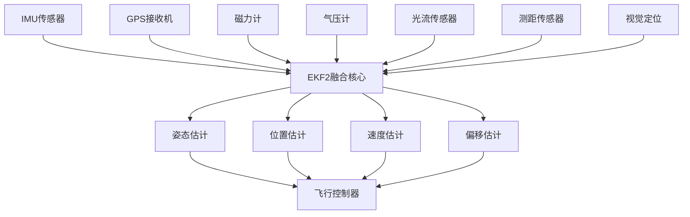

# PX4四旋翼数据融合系统详解

## 文档概述

本文档详细介绍PX4四旋翼控制系统中的数据融合机制，主要基于EKF2（扩展卡尔曼滤波器）模块实现。数据融合系统负责将多个传感器的测量数据进行最优估计，为飞行控制器提供准确的状态估计。

## 系统架构概览

### 核心模块结构

```
数据融合系统架构
├── EKF2模块 (src/modules/ekf2/)
│   ├── EKF2.cpp - 主要接口和数据管理
│   ├── EKF2Selector.cpp - 多实例选择器
│   └── EKF/ - 核心滤波器实现
│       ├── ekf.h - 核心EKF类定义
│       ├── estimator_interface.cpp - 估计器接口
│       ├── control.cpp - 融合控制逻辑
│       └── covariance.cpp - 协方差更新
├── 传感器输入处理
│   ├── IMU数据处理 (imu_down_sampler.cpp)
│   ├── GPS数据处理 (gps_control.cpp)
│   ├── 磁力计数据处理 (mag_control.cpp)
│   ├── 气压计数据处理 (baro_height_control.cpp)
│   └── 光流数据处理 (optflow_fusion.cpp)
└── 输出估计
    ├── 姿态估计 (vehicle_attitude)
    ├── 位置估计 (vehicle_local_position)
    ├── 全局位置估计 (vehicle_global_position)
    └── 速度估计 (vehicle_odometry)
```

### 数据流向



## EKF2核心算法

### 状态向量定义

EKF2维护一个24维状态向量，包含：

```cpp
// 状态向量构成 (24维)
typedef struct {
    Vector3f quat_nominal;     // 四元数 (0-2)  - 姿态表示
    Vector3f vel;              // 速度 (3-5)    - NED坐标系
    Vector3f pos;              // 位置 (6-8)    - NED坐标系
    Vector3f gyro_bias;        // 陀螺仪偏移 (9-11)
    Vector3f accel_bias;       // 加速度计偏移 (12-14)
    Vector3f mag_I;            // 磁场强度 (15-17) - 地球坐标系
    Vector3f mag_B;            // 磁场强度 (18-20) - 机体坐标系
    Vector2f wind_vel;         // 风速 (21-22)   - NE分量
    float terrain_height;      // 地形高度 (23)
} state24_t;
```

### 预测步骤（Predict Step）

#### 1. 状态预测

基于IMU数据进行状态预测：

```cpp
// 姿态预测 - 基于陀螺仪数据
void predictCovariance() {
    // 陀螺仪角速度预测
    Vector3f corrected_angular_rate = imu_sample.delta_ang / imu_sample.delta_ang_dt 
                                    - _state.gyro_bias;
    
    // 四元数预测
    Quatf dq;
    dq.from_axis_angle(corrected_angular_rate * dt);
    _state.quat_nominal = _state.quat_nominal * dq;
    _state.quat_nominal.normalize();
    
    // 速度预测
    Vector3f corrected_accel = imu_sample.delta_vel / imu_sample.delta_vel_dt 
                              - _state.accel_bias;
    Vector3f accel_earth = _R_to_earth * corrected_accel;
    accel_earth(2) += CONSTANTS_ONE_G;  // 补偿重力
    
    _state.vel += accel_earth * dt;
    
    // 位置预测
    _state.pos += _state.vel * dt;
}
```

#### 2. 协方差预测

```cpp
// 协方差矩阵预测 - 雅可比矩阵方法
void predictCovariance(float dt) {
    // 状态转移雅可比矩阵 F
    Matrix24f F = Matrix24f::Identity();
    
    // 填充非零元素
    F(0,9) = -0.5f * dt;   // dquat/dgyro_bias
    F(3,12) = dt;          // dvel/daccel_bias
    F(6,3) = dt;           // dpos/dvel
    
    // 过程噪声雅可比矩阵 G
    Matrix<float, 24, 15> G;
    G.setZero();
    
    // 协方差更新：P = F*P*F' + G*Q*G'
    P = F * P * F.transpose() + G * _process_noise_cov * G.transpose();
}
```

### 更新步骤（Update Step）

当传感器数据到达时，执行测量更新：

#### 1. GPS位置更新

```cpp
void fuseGpsPosition() {
    // 观测模型：h = pos_NED
    Vector3f innovation = _gps_sample_delayed.pos - _state.pos;
    
    // 观测雅可比矩阵 H
    Matrix<float, 3, 24> H;
    H.setZero();
    H(0,6) = 1.0f;  // dx/dpos_N
    H(1,7) = 1.0f;  // dy/dpos_E  
    H(2,8) = 1.0f;  // dz/dpos_D
    
    // 新息协方差 S = H*P*H' + R
    Matrix3f S = H * P * H.transpose() + _R_gps_pos;
    
    // 卡尔曼增益 K = P*H'*S^(-1)
    Matrix<float, 24, 3> K = P * H.transpose() * S.inverse();
    
    // 状态更新
    Vector<float, 24> state_correction = K * innovation;
    _state.pos += state_correction.slice<3,1>(6,0);
    
    // 协方差更新 P = (I - K*H)*P
    Matrix24f I_KH = Matrix24f::Identity() - K * H;
    P = I_KH * P * I_KH.transpose() + K * _R_gps_pos * K.transpose();
}
```

#### 2. 磁力计航向更新

```cpp
void fuseMagnetometer() {
    // 预测磁场
    Vector3f mag_pred = _R_to_body * _state.mag_I + _state.mag_B;
    
    // 新息计算
    Vector3f innovation = _mag_sample_delayed.mag - mag_pred;
    
    // 观测雅可比矩阵计算
    Matrix<float, 3, 24> H;
    computeMagInnovVarAndH(H);
    
    // 卡尔曼更新
    performMagUpdate(innovation, H);
}
```

## 传感器融合策略

### 多传感器优先级

PX4采用分层融合策略，传感器优先级如下：

```cpp
enum class SensorPriority {
    GPS_PRIMARY      = 0,    // GPS主要定位源
    VISION_SECONDARY = 1,    // 视觉定位辅助
    FLOW_BACKUP     = 2,    // 光流备份定位
    BARO_HEIGHT     = 3,    // 气压计高度
    RANGE_HEIGHT    = 4,    // 测距仪高度
    MAG_HEADING     = 5,    // 磁力计航向
};
```

### 传感器健康检查

```cpp
class SensorHealthCheck {
    struct HealthStatus {
        bool innovation_check;     // 新息检查
        bool variance_check;       // 方差检查  
        bool timeout_check;        // 超时检查
        bool consistency_check;    // 一致性检查
    };
    
    bool checkGpsHealth() {
        // GPS健康检查
        bool health = true;
        health &= (gps_innovation < _params->gps_pos_innov_gate);
        health &= (gps_variance > _params->gps_min_variance);
        health &= (time_since_last_gps < GPS_TIMEOUT_MS);
        return health;
    }
};
```

### 自适应融合权重

```cpp
void adaptiveFusionWeights() {
    // 根据传感器质量调整融合权重
    float gps_weight = calculateGpsWeight();
    float vision_weight = calculateVisionWeight();
    float flow_weight = calculateFlowWeight();
    
    // 归一化权重
    float total_weight = gps_weight + vision_weight + flow_weight;
    if (total_weight > 0) {
        gps_weight /= total_weight;
        vision_weight /= total_weight;
        flow_weight /= total_weight;
    }
    
    // 应用权重到融合过程
    applyFusionWeights(gps_weight, vision_weight, flow_weight);
}
```

## 故障检测与隔离

### 新息监测

```cpp
class InnovationMonitor {
public:
    struct InnovationStats {
        float mean;           // 新息均值
        float variance;       // 新息方差
        float normalized;     // 标准化新息
        uint32_t reject_count;  // 拒绝计数
    };
    
    bool detectFault(const Vector3f& innovation, const Matrix3f& S) {
        // 标准化新息测试
        Vector3f normalized_innov = innovation.cwiseQuotient(S.diagonal().cwiseSqrt());
        
        // 卡方检验
        float test_statistic = normalized_innov.transpose() * S.inverse() * normalized_innov;
        float chi2_threshold = 7.815f;  // 3-DOF, 95%置信度
        
        return (test_statistic > chi2_threshold);
    }
};
```

### 传感器切换逻辑

```cpp
void sensorSwitchingLogic() {
    // GPS故障检测
    if (detectGpsFault()) {
        // 切换到视觉定位
        if (isVisionAvailable()) {
            switchToVisionPositioning();
        } 
        // 或切换到光流定位
        else if (isOpticalFlowAvailable()) {
            switchToOpticalFlowPositioning();
        }
    }
    
    // 磁力计故障检测
    if (detectMagFault()) {
        // 切换到GPS航向
        if (isGpsYawAvailable()) {
            switchToGpsYaw();
        }
    }
}
```

## 滤波器参数调优

### 关键参数说明

| 参数名称 | 默认值 | 说明 | 调优建议 |
|---------|--------|------|----------|
| EKF2_GYRO_NOISE | 1.5e-2 | 陀螺仪噪声 | 根据IMU规格调整 |
| EKF2_ACC_NOISE | 3.5e-1 | 加速度计噪声 | 根据振动水平调整 |
| EKF2_GPS_V_NOISE | 0.5 | GPS速度噪声 | 根据GPS质量调整 |
| EKF2_GPS_P_NOISE | 0.5 | GPS位置噪声 | 根据GPS精度调整 |
| EKF2_BARO_NOISE | 2.0 | 气压计噪声 | 根据气压稳定性调整 |

### 参数调优流程

```cpp
void parameterTuning() {
    // 1. 基础噪声参数调整
    adjustBasicNoiseParams();
    
    // 2. 新息门限调整
    adjustInnovationGates();
    
    // 3. 融合超时参数调整
    adjustFusionTimeouts();
    
    // 4. 质量检查参数调整
    adjustQualityCheckParams();
}
```

### 自动调参算法

```cpp
class AutoTuner {
public:
    void runAutoTune() {
        // 收集飞行数据
        collectFlightData();
        
        // 分析新息统计
        analyzeInnovationStats();
        
        // 优化参数
        optimizeParameters();
        
        // 验证调优结果
        validateTuningResults();
    }
    
private:
    void optimizeParameters() {
        // 使用最小二乘法优化噪声参数
        Matrix<float, N_PARAMS, 1> optimal_params = 
            solveWeightedLeastSquares(innovation_data, weight_matrix);
            
        // 应用优化后的参数
        applyOptimalParameters(optimal_params);
    }
};
```

## 性能监控与诊断

### 关键性能指标

```cpp
struct EKFPerformanceMetrics {
    // 新息统计
    InnovationStats gps_innov;
    InnovationStats mag_innov;
    InnovationStats baro_innov;
    
    // 协方差追踪
    float pos_variance;      // 位置不确定度
    float vel_variance;      // 速度不确定度
    float att_variance;      // 姿态不确定度
    
    // 计算负载
    uint32_t predict_time_us;  // 预测计算时间
    uint32_t update_time_us;   // 更新计算时间
    float cpu_load_percent;    // CPU负载百分比
};
```

### 实时诊断工具

```cpp
class EKFDiagnostics {
public:
    void publishDiagnostics() {
        ekf2_innovation_s innov{};
        
        // GPS新息
        innov.gps_hvel[0] = _aid_src_gnss_pos.innovation[0];
        innov.gps_hvel[1] = _aid_src_gnss_pos.innovation[1];
        innov.gps_vvel = _aid_src_gnss_pos.innovation[2];
        
        // 磁力计新息
        innov.mag_field[0] = _aid_src_mag.innovation[0];
        innov.mag_field[1] = _aid_src_mag.innovation[1];
        innov.mag_field[2] = _aid_src_mag.innovation[2];
        
        _ekf2_innovation_pub.publish(innov);
    }
};
```

## 多旋翼特定优化

### 快速姿态恢复

```cpp
void fastAttitudeRecovery() {
    // 检测大姿态偏差
    if (attitude_error > LARGE_ANGLE_THRESHOLD) {
        // 增加IMU权重
        increaseIMUWeight();
        
        // 临时忽略GPS/视觉输入
        temporaryIgnorePositionSensors();
        
        // 快速重新初始化
        fastReinitialize();
    }
}
```

### 动态响应调整

```cpp
void adaptToFlightPhase() {
    switch (current_flight_phase) {
    case TAKEOFF:
        // 起飞阶段：增加高度传感器权重
        increaseBaro Weight();
        break;
        
    case CRUISE:
        // 巡航阶段：平衡所有传感器
        balanceAllSensors();
        break;
        
    case LANDING:
        // 降落阶段：增加测距仪权重
        increaseRangeFinderWeight();
        break;
    }
}
```

## 故障场景应对

### GPS拒止环境

```cpp
void handleGpsDeniedEnvironment() {
    if (gps_quality_poor) {
        // 启用视觉-惯导融合
        enableVisionInertialFusion();
        
        // 启用光流辅助定位
        enableOpticalFlowAiding();
        
        // 使用磁力计维持航向
        maintainHeadingWithMag();
        
        // 降低位置估计精度要求
        relaxPositionAccuracyRequirements();
    }
}
```

### 磁干扰环境

```cpp
void handleMagneticDisturbance() {
    if (magnetic_interference_detected) {
        // 切换到GPS航向
        if (gps_yaw_available) {
            switchToGpsYaw();
        }
        
        // 或使用双天线GPS
        else if (dual_antenna_gps_available) {
            enableDualAntennaGps();
        }
        
        // 最后备案：惯性航向维持
        else {
            maintainInertialHeading();
        }
    }
}
```

### 传感器完全失效

```cpp
void handleSensorFailure(SensorType failed_sensor) {
    switch (failed_sensor) {
    case IMU_FAILURE:
        // IMU失效：切换到备用IMU
        switchToBackupIMU();
        break;
        
    case GPS_FAILURE:
        // GPS失效：纯惯导模式
        enterDeadReckoningMode();
        break;
        
    case MAG_FAILURE:
        // 磁力计失效：GPS航向辅助
        useGpsHeadingAiding();
        break;
    }
}
```

## 算法验证与测试

### 蒙特卡洛仿真

```cpp
class MonteCarloSimulation {
public:
    void runSimulation(int num_runs) {
        for (int i = 0; i < num_runs; ++i) {
            // 生成随机传感器数据
            generateRandomSensorData();
            
            // 运行EKF
            runEKFInstance();
            
            // 记录结果
            recordResults();
        }
        
        // 统计分析
        analyzeResults();
    }
};
```

### 实际飞行验证

```cpp
void flightTestValidation() {
    // 记录关键指标
    struct FlightTestMetrics {
        float position_error_rms;    // 位置误差均方根
        float velocity_error_rms;    // 速度误差均方根
        float attitude_error_rms;    // 姿态误差均方根
        float convergence_time;      // 收敛时间
    };
    
    // 对比不同飞行条件下的性能
    validateInDifferentConditions();
}
```

## 代码文件索引

### 核心文件

| 功能模块 | 文件位置 | 主要功能 |
|---------|----------|----------|
| EKF2主模块 | `src/modules/ekf2/EKF2.cpp` | EKF2接口和数据管理 |
| 滤波器核心 | `src/modules/ekf2/EKF/ekf.h` | EKF算法核心实现 |
| 状态预测 | `src/modules/ekf2/EKF/covariance.cpp` | 协方差预测 |
| GPS融合 | `src/modules/ekf2/EKF/gps_control.cpp` | GPS数据融合控制 |
| 磁力计融合 | `src/modules/ekf2/EKF/mag_control.cpp` | 磁力计数据融合 |
| 高度融合 | `src/modules/ekf2/EKF/height_control.cpp` | 高度数据融合 |

### 参数文件

| 参数类别 | 文件位置 | 说明 |
|---------|----------|------|
| 核心参数 | `src/modules/ekf2/EKF2.cpp` | EKF2主要参数定义 |
| 多实例参数 | `src/modules/ekf2/params_multi.yaml` | 多EKF实例参数 |
| 选择器参数 | `src/modules/ekf2/params_selector.yaml` | EKF选择器参数 |

## 常见问题与解决方案

### Q1: EKF2无法收敛

**症状**: 位置估计发散，飞行器无法稳定悬停

**排查步骤**:
1. 检查IMU标定是否准确
2. 验证传感器安装方向
3. 调整噪声参数
4. 检查振动水平

**解决方案**:
```bash
# 重新标定IMU
commander calibrate accel
commander calibrate gyro

# 调整噪声参数
param set EKF2_ACC_NOISE 0.35
param set EKF2_GYRO_NOISE 0.015
```

### Q2: GPS切换频繁

**症状**: EKF在GPS和非GPS模式间频繁切换

**原因分析**: GPS信号质量不稳定，新息门限设置过严

**解决方案**:
```bash
# 放宽GPS门限
param set EKF2_GPS_P_GATE 5.0
param set EKF2_GPS_V_GATE 5.0

# 增加GPS检查容忍度
param set EKF2_REQ_EPH 3.0
param set EKF2_REQ_EPV 5.0
```

### Q3: 磁力计干扰严重

**症状**: 航向估计不准确，飞行器自旋

**解决方案**:
```bash
# 启用GPS航向辅助
param set EKF2_GPS_CTRL 7

# 或者禁用磁力计融合
param set EKF2_MAG_TYPE 5
```

## 未来发展方向

### 机器学习增强

```cpp
class MLEnhancedEKF {
public:
    // 使用神经网络预测传感器误差
    Vector3f predictSensorError(const SensorData& data) {
        return neural_network_.predict(data);
    }
    
    // 自适应参数调整
    void adaptiveParameterTuning() {
        auto optimal_params = ml_optimizer_.optimize(performance_history_);
        applyParameters(optimal_params);
    }
};
```

### 分布式融合

```cpp
class DistributedFusion {
public:
    // 多节点协同状态估计
    void collaborativeStateEstimation() {
        // 与其他飞行器交换状态信息
        exchangeStateWithNeighbors();
        
        // 分布式卡尔曼滤波
        performDistributedKalmanFiltering();
    }
};
```

---

**注意**: 本文档基于PX4 v1.14版本，不同版本可能存在差异。数据融合系统的性能直接影响飞行安全，任何参数修改都应在仿真环境中充分测试。