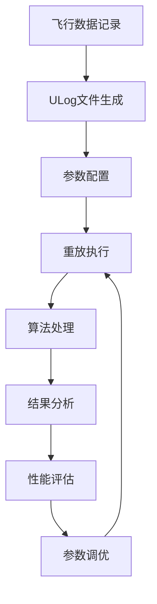

# 系统后处理和EKF后处理实现机制详解

## 概述

本文档详细分析FihawkFlyCtrl（基于PX4）系统中的后处理机制，重点介绍系统级后处理和EKF2（Extended Kalman Filter 2）的后处理实现。这些机制是飞控算法验证、参数调优和性能分析的核心工具。

## 1. 系统级后处理架构

### 1.1 数据重放（Replay）系统

#### 核心组件
- **Replay模块** (`src/modules/replay/Replay.cpp`):122 - 通用重放系统
- **ReplayEkf2模块** (`src/modules/replay/ReplayEkf2.cpp`):62 - EKF2专用重放系统  
- **后处理分析工具** (`Tools/ecl_ekf/analysis/post_processing.py`):3 - Python分析工具集

#### 数据流架构
```
原始飞行数据流:
传感器硬件 → 驱动程序 → uORB消息 → 算法模块 → 控制输出
    ↓
记录到ULog文件

后处理数据流:
ULog文件 → Replay模块 → uORB消息 → 算法模块 → 分析输出
              ↓
        替代传感器数据源
```

### 1.2 重放系统核心机制

#### 时间戳同步机制 (`src/modules/replay/ReplayEkf2.cpp`):121
```cpp
bool ReplayEkf2::publishEkf2Topics(const ekf2_timestamps_s &ekf2_timestamps, std::ifstream &replay_file)
{
    auto handle_sensor_publication = [&](int16_t timestamp_relative, uint16_t msg_id) {
        if (timestamp_relative != ekf2_timestamps_s::RELATIVE_TIMESTAMP_INVALID) {
            // 将相对时间戳转换为绝对时间戳
            uint64_t t = timestamp_relative + ekf2_timestamps.timestamp / 100;
            findTimestampAndPublish(t, msg_id, replay_file);
        }
    };
    
    // 按照EKF2时间戳同步发布传感器数据
    handle_sensor_publication(ekf2_timestamps.airspeed_timestamp_rel, _airspeed_msg_id);
    handle_sensor_publication(ekf2_timestamps.distance_sensor_timestamp_rel, _distance_sensor_msg_id);
    handle_sensor_publication(ekf2_timestamps.optical_flow_timestamp_rel, _optical_flow_msg_id);
    // ... 更多传感器数据
}
```

#### 消息订阅管理 (`src/modules/replay/ReplayEkf2.cpp`):86
```cpp
void ReplayEkf2::onSubscriptionAdded(Subscription &sub, uint16_t msg_id)
{
    // 识别并记录各类传感器消息ID
    if (sub.orb_meta == ORB_ID(sensor_combined)) {
        _sensor_combined_msg_id = msg_id;
    } else if (sub.orb_meta == ORB_ID(airspeed)) {
        _airspeed_msg_id = msg_id;
    }
    // ... 处理其他传感器类型
    
    // 标记主循环应忽略的消息类型
    sub.ignored = sub.orb_meta != ORB_ID(ekf2_timestamps) 
                  && sub.orb_meta != ORB_ID(vehicle_status)
                  && sub.orb_meta != ORB_ID(vehicle_land_detected);
}
```

### 1.3 锁步同步机制

#### 组件同步 (`src/modules/replay/ReplayEkf2.cpp`):73
```cpp
// 等待所有模块处理完当前数据
px4_lockstep_wait_for_components();
```

这个机制确保：
- 所有模块按照严格的时间顺序处理数据
- 避免竞争条件和时间同步问题
- 保证重放结果的确定性和可重复性

## 2. EKF2后处理系统

### 2.1 EKF2主运行循环

#### 核心处理函数 (`src/modules/ekf2/EKF2.cpp`):400
```cpp
void EKF2::Run()
{
    if (should_exit()) {
        _sensor_combined_sub.unregisterCallback();
        ScheduledWorkItem::exit_and_cleanup();
        return;
    }

    // 处理传感器数据更新
    bool sensor_updated = _sensor_combined_sub.updated();
    bool vehicle_imu_updated = _vehicle_imu_sub.updated();

    if (sensor_updated || vehicle_imu_updated) {
        // 执行EKF预测和更新步骤
        bool updated = UpdateSensorBuffers(hrt_absolute_time());
        
        if (updated) {
            // 执行状态预测
            _ekf.predictState(imu);
            
            // 执行测量更新
            _ekf.fuseSensorData();
            
            // 发布状态估计结果
            PublishStates(now);
            PublishStatus(now);
        }
    }
}
```

### 2.2 传感器数据缓冲和处理

#### 数据缓冲管理 (`src/modules/ekf2/EKF/estimator_interface.cpp`):530
```cpp
// 限制观测缓冲区长度不超过IMU缓冲区
// (我们无法比EKF预测速率更快地处理数据)
_obs_buffer_length = math::min(_obs_buffer_length, _imu_buffer_length);
```

#### 地形估计器运行 (`src/modules/ekf2/EKF/terrain_estimator.cpp`):63
```cpp
void Ekf::runTerrainEstimator(const imuSample &imu_delayed)
{
    // 如果在地面，存储本地位置和时间作为参考
    if (!_control_status.flags.in_air) {
        _time_last_on_ground_us = imu_delayed.time_us;
        _last_on_ground_posD = _state.pos(2);
    }
    
    // 预测地形高度
    predictHagl(imu_delayed);
    
    // 融合距离传感器数据
    controlHaglRngFusion();
    
    // 融合光流数据
    controlHaglFlowFusion();
}
```

### 2.3 传感器检查和验证

#### 距离传感器检查 (`src/modules/ekf2/EKF/sensor_range_finder.cpp`):48
```cpp
void SensorRangeFinder::runChecks(const uint64_t current_time_us, const Dcmf &R_to_earth)
{
    // 更新传感器到地球坐标系的转换
    updateSensorToEarthRotation(R_to_earth);
    
    // 更新数据有效性
    updateValidity(current_time_us);
    
    // 执行质量检查
    _is_sample_valid = isDataInRange() && isDataValid() && !isDataStuck();
}
```

## 3. 后处理分析工具

### 3.1 GPS检查失败标志分析

#### GPS检查状态解析 (`Tools/ecl_ekf/analysis/post_processing.py`):10
```python
def get_gps_check_fail_flags(estimator_status: dict) -> dict:
    """
    解析GPS检查失败标志位
    :param estimator_status: EKF估计器状态数据
    :return: GPS检查失败标志字典
    """
    gps_fail_flags = dict()

    # GPS检查失败类型定义:
    # 0: 定位类型不足 (无3D解算)
    # 1: 最小卫星数量不满足要求
    # 2: PDOP超出最大允许值
    # 3: 水平位置误差超出最大允许值
    # 4: 垂直位置误差超出最大允许值
    # 5: 速度误差超出最大允许值
    # 6: 水平位置漂移超出最大允许值
    # 7: 垂直位置漂移超出最大允许值
    # 8: 水平速度超出最大允许值
    # 9: 垂直速度差异超出最大允许值
    
    gps_fail_flags['gfix_fail'] = ((2 ** 0 & estimator_status['gps_check_fail_flags']) > 0) * 1
    gps_fail_flags['nsat_fail'] = ((2 ** 1 & estimator_status['gps_check_fail_flags']) > 0) * 1
    gps_fail_flags['pdop_fail'] = ((2 ** 2 & estimator_status['gps_check_fail_flags']) > 0) * 1
    # ... 更多标志位解析
    
    return gps_fail_flags
```

### 3.2 磁场估计分析

#### 磁场状态估计 (`Tools/ecl_ekf/analysis/post_processing.py`):40
```python
def magnetic_field_estimates_from_states(estimator_states: dict) -> Tuple[float, float, float]:
    """
    从EKF状态中提取磁场估计参数
    :param estimator_states: EKF状态数据
    :return: (磁偏角, 磁场强度, 磁倾角)
    """
    rad2deg = 57.2958
    
    # 计算磁场强度 (states[16-18]是磁场状态)
    field_strength = np.sqrt(
        estimator_states['states[16]'] ** 2 + 
        estimator_states['states[17]'] ** 2 +
        estimator_states['states[18]'] ** 2
    )
    
    # 计算磁偏角
    declination = rad2deg * np.arctan2(estimator_states['states[17]'],
                                       estimator_states['states[16]'])
    
    # 计算磁倾角
    inclination = rad2deg * np.arcsin(
        estimator_states['states[18]'] / np.maximum(field_strength, np.finfo(np.float32).eps)
    )
    
    return declination, field_strength, inclination
```

## 4. 处理机制的技术特点

### 4.1 时间同步策略

```
原始时间轴:  |----A----B----C----D----|
                ↓ 时间偏移调整
重放时间轴:  |----A'---B'---C'---D'---|
```

- **绝对时间戳调整**: 将历史时间戳映射到当前系统时间
- **相对时间关系保持**: 维护原始数据间的时间间隔
- **高精度同步**: 微秒级时间戳精度确保算法行为一致性

### 4.2 数据流控制机制

#### ORB发布权限管理
```bash
# orb_publisher.rules 示例
restrict_topics: sensor_combined, vehicle_gps_position, vehicle_land_detected
module: replay
ignore_others: true
```

**控制策略:**
- **单一数据源**: 确保重放期间只有Replay模块发布传感器数据
- **冲突避免**: 阻止真实传感器驱动与重放数据冲突
- **数据完整性**: 保证重放数据的唯一性和一致性

### 4.3 EKF2专用优化

#### 批量数据发布 (`src/modules/replay/ReplayEkf2.cpp`):131-137
```cpp
// 基于EKF2时间戳批量发布相关传感器数据
handle_sensor_publication(ekf2_timestamps.airspeed_timestamp_rel, _airspeed_msg_id);
handle_sensor_publication(ekf2_timestamps.distance_sensor_timestamp_rel, _distance_sensor_msg_id);
handle_sensor_publication(ekf2_timestamps.optical_flow_timestamp_rel, _optical_flow_msg_id);
handle_sensor_publication(ekf2_timestamps.vehicle_air_data_timestamp_rel, _vehicle_air_data_msg_id);
handle_sensor_publication(ekf2_timestamps.vehicle_magnetometer_timestamp_rel, _vehicle_magnetometer_msg_id);

// 最后发布sensor_combined，因为EKF2在此消息上进行轮询
if (!findTimestampAndPublish(ekf2_timestamps.timestamp / 100, _sensor_combined_msg_id, replay_file)) {
    // 处理发布失败的情况
}
```

**优化效果:**
- **执行效率**: 比通用重放模式快数倍
- **时间精度**: 以EKF2内部时间戳为基准同步
- **数据一致性**: 确保传感器数据的时间关联性

## 5. 应用场景和工作流程

### 5.1 典型后处理工作流程



#### 参数调优示例
```bash
# replay_params.txt - 静态参数覆盖
EKF2_GPS_NOISE 0.8        # 增加GPS噪声容忍度
EKF2_GPS_DELAY 150        # 调整GPS延迟补偿
EKF2_BARO_NOISE 1.5       # 提高气压计权重

# replay_params_dynamic.txt - 动态参数调整
EKF2_MAG_NOISE 0.05 0.0    # 初始正常状态
EKF2_MAG_NOISE 2.0 45.5    # 45.5秒时模拟干扰
EKF2_MAG_NOISE 0.05 60.0   # 60秒时恢复正常
```

### 5.2 性能分析工具链

#### 数据一致性验证
```python
#!/usr/bin/env python3
def verify_processing_consistency(original_log, processed_log):
    """验证后处理数据的一致性"""
    ulog_orig = ULog(original_log)
    ulog_proc = ULog(processed_log)
    
    # 检查消息完整性
    orig_msgs = len(ulog_orig.get_dataset('sensor_combined').data['timestamp'])
    proc_msgs = len(ulog_proc.get_dataset('sensor_combined').data['timestamp'])
    
    print(f"原始消息数: {orig_msgs}")
    print(f"处理消息数: {proc_msgs}")
    print(f"数据完整性: {proc_msgs/orig_msgs*100:.2f}%")
    
    # 分析算法性能差异
    analyze_algorithm_performance(ulog_orig, ulog_proc)
```

## 6. 错误处理和容错机制

### 6.1 数据完整性保护

#### 时间戳验证 (`src/modules/replay/ReplayEkf2.cpp`):176
```cpp
if (sub.next_timestamp / 100 != timestamp) {
    // 时间戳不匹配的处理
    PX4_DEBUG("No timestamp match found for topic %s (%i, %i)", 
              sub.orb_meta->o_name, (int)sub.next_timestamp / 100, timestamp);
    ++sub.error_counter;
    return false;
}
```

### 6.2 噪声处理机制

#### 坏加速计检测 (`src/modules/ekf2/EKF/covariance.cpp`):119
```cpp
// 如果检测到坏的加速计数据，增加加速计处理噪声
if (_fault_status.flags.bad_acc_vertical || imu_delayed.delta_vel_clipping[i]) {
    accel_var(i) = sq(BADACC_BIAS_PNOISE);  // 4.9 m/s²的处理噪声
}
```

## 7. 技术优势和限制

### 7.1 技术优势

1. **完全可重复性**: 相同输入保证相同输出
2. **高精度时间同步**: 微秒级时间戳精度
3. **灵活参数调整**: 支持静态和动态参数修改
4. **模块化设计**: 便于扩展和定制
5. **高效执行**: 针对EKF2优化的专用重放模式

### 7.2 使用限制

1. **实时性约束**: 必须按原始时间速度重放
2. **硬件抽象**: 无法模拟真实硬件故障
3. **环境依赖**: 无法重现外部环境变化
4. **存储需求**: 大数据文件需要充足存储空间
5. **计算资源**: 复杂分析需要足够的处理能力

## 8. 最佳实践建议

### 8.1 数据收集阶段
- 使用高频率采样确保数据完整性
- 记录详细的飞行环境信息
- 确保传感器标定准确性

### 8.2 后处理分析阶段
- 建立基线重放作为参考
- 系统化记录参数变化和结果
- 使用统计方法分析性能变化

### 8.3 性能优化建议
- 使用SSD存储提高I/O性能
- 配置足够RAM避免内存交换
- 优化编译选项提高执行效率

---

通过理解这些后处理机制的实现原理，开发者可以更有效地进行算法验证、参数调优和性能分析，从而提高FihawkFlyCtrl飞控系统的整体性能和可靠性。这些机制体现了现代飞控软件在可测试性、可重复性和可维护性方面的先进设计理念。